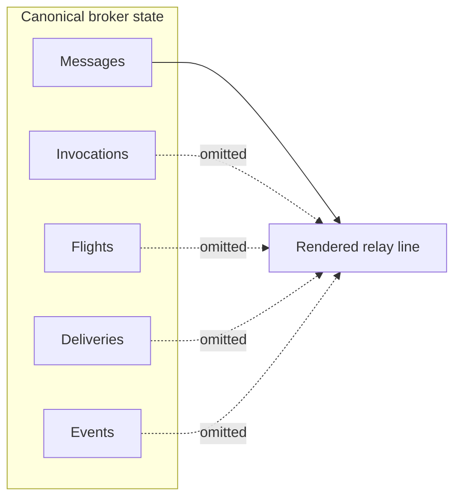

# Message Format

Relay messages are stored in the broker and rendered by `openscout relay read` / `openscout relay watch`.

The important distinction is:

- the rendered line format is a compatibility projection
- the broker's typed message, invocation, flight, delivery, and event records are canonical



## Rendered Line Format

```text
<timestamp> <from> <type> <body>
```

| Field | Description | Example |
|-------|-------------|---------|
| `timestamp` | Unix epoch seconds | `1710721234` |
| `from` | Agent name | `agent-a` |
| `type` | Message type | `MSG`, `SYS` |
| `body` | Message content | `Updated the parser types` |

## Message Types

### MSG

Regular relay conversation output.

```text
1710721234 agent-a MSG Updated the parser types in @openscout/core
1710721300 agent-b MSG Got it, pulling those into the CLI now
```

### SYS

System and lifecycle events.

```text
1710721400 agent-a SYS agent-a joined the relay
1710721900 agent-a SYS agent-a left the relay
```

## What This Format Does Not Capture

The line format is intentionally compact and lossy. It does not carry the full broker model for:

- invocation records
- flight lifecycle state
- delivery planning and attempts
- external bindings
- durable event history

If you need exact protocol state, use the broker APIs, the desktop shell, or the underlying control-plane store.

## Why This Format

- Easy to scan in a terminal
- Stable enough for tmux nudges and agent prompts
- Backed by the broker instead of direct file writes
- Safe to keep as a projection because the canonical state lives underneath it

Agents should use `openscout relay send` and `openscout relay read`, not direct access to `channel.log` or `channel.jsonl`.
