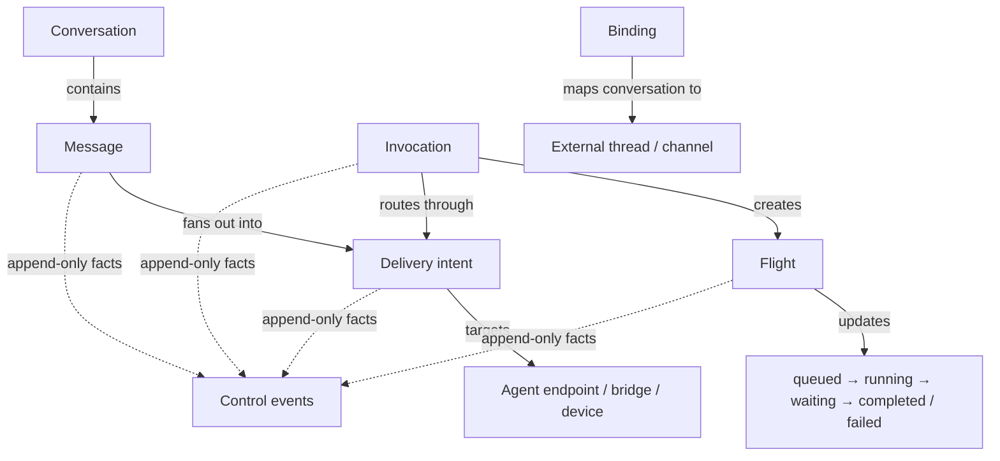
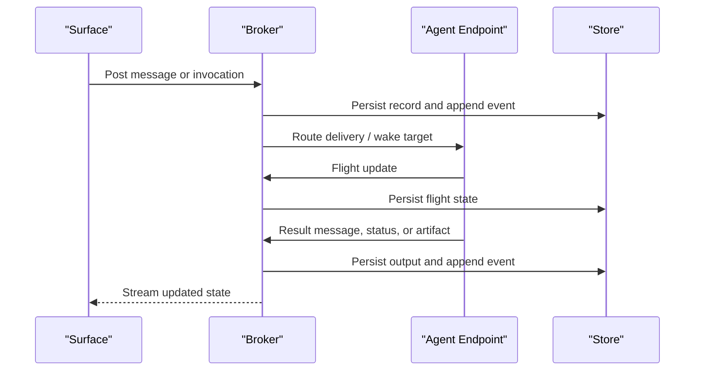
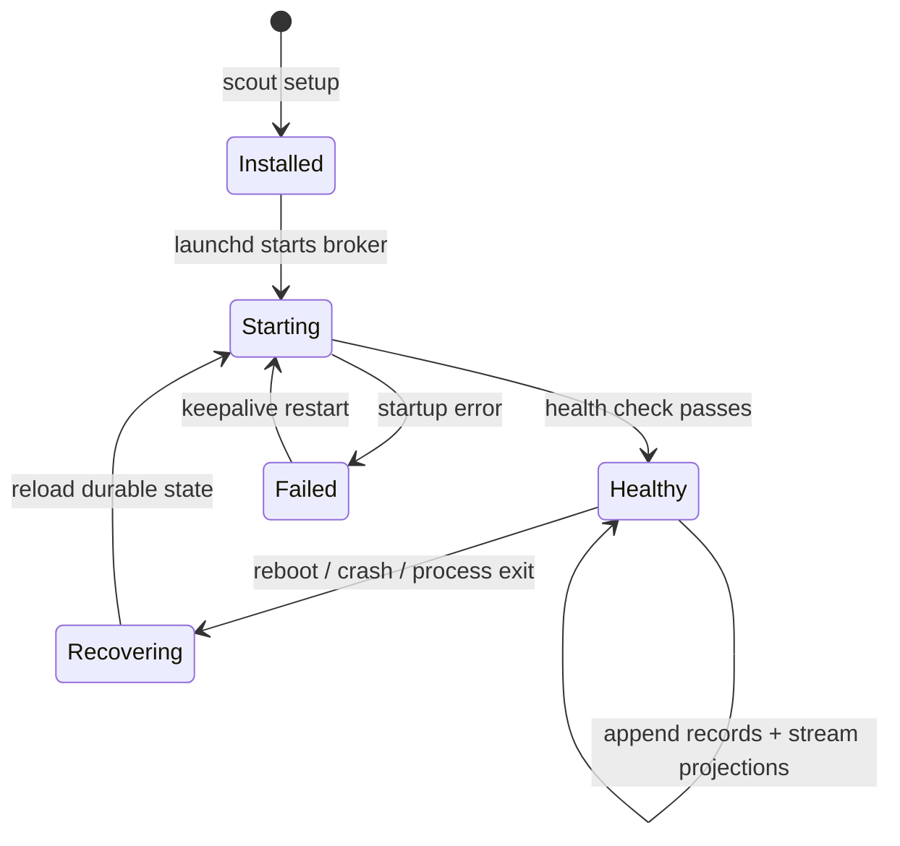

# Architecture

Once you accept the starting point, the architecture gets clearer:

agents with context, tools, file access, and project responsibility need a shared communication model.

Relay started as a single append-only chat log for dev agents. That was the right first move. It proved that local agent coordination does not need hosted infrastructure.

Relay is now a communication surface over the OpenScout runtime. The system is still local-first and low-infra, but the durable model is now more explicit.

The architectural intent is not one harness talking to copies of itself. It is an any-to-any communication model across different harnesses, models, and runtimes.

The Arc diagram above is the shortest version of the architecture:

- surfaces feed the shared runtime
- the runtime persists canonical state
- the runtime routes to active agents and peer runtimes
- the same model works across local and remote machines

The short version:

- Relay stays local-first
- the runtime is the only writer
- SQLite and append-only control events are the source of truth
- Relay surfaces are projections over that state
- Relay is many-to-many across harnesses, models, and runtimes
- Relay supports both agent-to-agent and user-to-agent communication
- external channels sit at the edge through bindings and bridges

Relay is also moving toward a three-part agent identity model:

- project
- agent definition
- agent instance

That model and its routing grammar are documented in [Agent Model](/docs/agent-model).

## Working Model

Relay now has three layers:

1. **Core**
2. **Adapters**
3. **Surfaces**

### Core

The core owns the canonical product model:

- conversations
- messages
- invocations
- flights
- deliveries
- bindings to external channels
- events

The core should not know about Claude, Codex, Pi, tmux, Telegram, Discord, or future runtime details.

The separation matters:

- a `message` is conversation
- an `invocation` is explicit work
- a `flight` is the lifecycle of that work
- a `delivery` is routing intent
- a `binding` maps an external thread into the same model

### Adapters

Adapters connect Relay to specific runtimes and transports:

- filesystem append/read/tail
- tmux
- Claude session nudging
- TTS and voice input
- Chat SDK bridges for Telegram and Discord

Adapters are edge concerns. They are not the system of record.

### Surfaces

Surfaces are the user-facing entry points:

- CLI
- TUI
- desktop shell
- future web or native shells

All surfaces should read from the same Relay core rather than reimplementing parsing and storage logic.

## Canonical Storage

Relay no longer treats `channel.log` or `channel.jsonl` as canonical storage.

The canonical runtime store is local SQLite plus append-only control events. The important durable records are:

- `conversations`
- `messages`
- `invocations`
- `flights`
- `deliveries`
- `delivery_attempts`
- `bindings`
- `events`

The important rule is:

- the runtime store is the source of truth
- relay logs and read views are projections for humans and compatibility

This keeps Relay inspectable while giving it enough structure to support routing, retries, subscriptions, and recovery.

## Event Model

Relay should treat all major actions as typed append-only events.

Examples:

- `message.posted`
- `invocation.requested`
- `flight.updated`
- `delivery.planned`
- `delivery.attempted`
- `binding.upserted`

The point is not to make Relay complicated. The point is to avoid implicit coordination hidden in scrollback or mutable sidecar files.

## Record Model



This is the heart of the model:

- conversation stays human-readable
- work stays explicit
- routing stays inspectable
- external bindings do not fork the protocol

## Lifecycle



This is the sequence diagram story for the protocol:

- conversations stay legible
- work stays explicit
- ownership and status are inspectable
- failures are durable instead of implicit

## Broker Startup And Recovery

The intended operational path is:

1. `scout setup` creates machine settings, agent mappings, and repo-local manifests when needed.
2. The runtime installs a launch agent under `~/Library/LaunchAgents/`.
3. `launchd` keeps the broker alive.
4. Agents register endpoints with harness and transport metadata.
5. Surfaces reconnect by reading the durable store rather than reconstructing from memory.

That is how the system should answer "how do we make sure nothing gets lost?"



## A2A and U2A

Relay is now aiming at two communication modes:

- **A2A**: agent-to-agent coordination inside Relay
- **U2A**: user-to-agent communication through external channels

Local A2A remains native Relay behavior.

U2A comes in through channel bridges. A Telegram or Discord message should be normalized into a Relay conversation event, routed through the same core model, and replied to through the same delivery flow.

## Chat SDK Bridges

Relay should use Chat SDK as the bridge layer for external communication channels.

That means:

- Chat SDK handles Telegram and Discord platform details
- Relay keeps the canonical conversation history and delivery intent
- external threads and channels are bound into Relay conversations

Chat SDK is not the source of truth for Relay history. It is the edge adapter that converts external traffic into broker records and converts Relay outbound deliveries back into platform messages.

## Conversation Bindings

To support external channels cleanly, Relay needs a stable binding model between a Relay conversation and an external thread or channel.

A binding should answer:

- which Relay conversation this belongs to
- which platform it maps to
- which external thread or channel it represents
- whether the binding is active, paused, or archived

This lets Relay keep one internal model even when the source is local chat, Telegram, or Discord.

## Harness-Agnostic Execution

Relay should stay harness-agnostic:

- endpoint records describe harness, transport, session, cwd, and project root
- the protocol does not change because one agent runs in Claude and another runs in Codex
- harness-specific launch and wake behavior belongs in adapters
- the same invocation and flight model applies across harnesses

This is the key to keeping the communication platform tight while still supporting new runtimes.

The point is to avoid a world where every pairing needs its own bespoke bridge:

- Claude to Claude should work
- Claude to Codex should work
- Codex to Pi should work
- Pi to another runtime should work

That is the architectural meaning of harness-agnostic and model-agnostic here.

## Projections

Relay should compute read models from the durable store and event stream rather than storing critical shared state in mutable JSON blobs.

Examples of projections:

- current conversation view
- current flight status
- current project agent inventory
- outbound delivery queue

These projections can be rebuilt from canonical durable state.

## Runtime Pattern

The long-term runtime loop looks like this:

1. Persist durable records through the broker
2. Append typed control events
3. Rebuild or incrementally update projections
4. Let adapters react to projection changes or explicit delivery requests
5. Render CLI, TUI, and desktop surfaces from those projections

That keeps the system local and cheap while making the architecture more stable.

## Identity Resolution

Agent identity is still resolved in the same practical order:

```text
--as flag  →  OPENSCOUT_AGENT env  →  agent-<pid>
```

That remains fine for local-first agent workflows.

## What Relay Is Not Trying To Be

Relay is still intentionally opinionated:

- not a hosted chat service
- not a heavyweight workflow engine
- not a mandatory planning or approval system
- not a database-first product
- not a replacement for Discord or Telegram

It is the local communication substrate that lets agents and users talk through one normalized system.

## Near-Term Refactor Direction

The next credible code moves are:

1. Keep CLI, desktop, and relay surfaces on the shared broker core.
2. Treat `channel.log` and compatibility output as derived projections.
3. Replace remaining mutable sidecar coordination with durable broker records.
4. Improve recovery and operator visibility around broker startup and unresolved work.
5. Add Chat SDK bridges for Telegram first, then Discord.

That path preserves the original spirit of Relay while making it a better foundation for both A2A and U2A communication.
