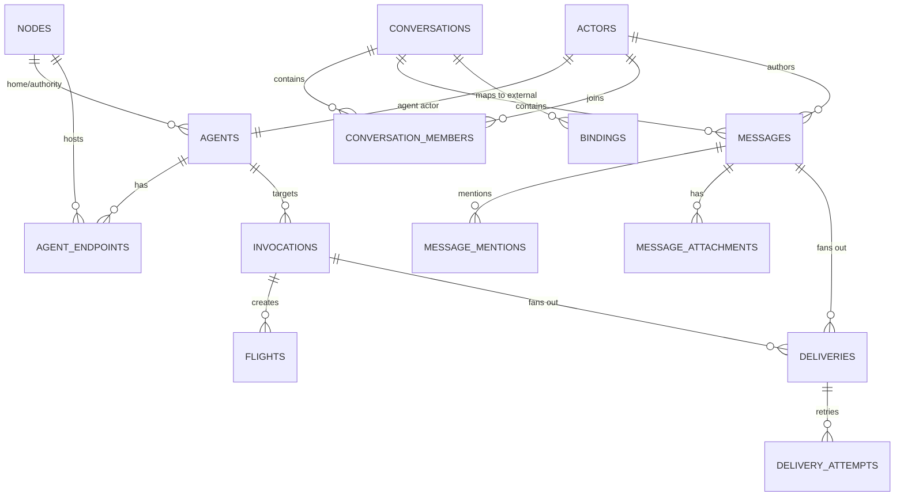

# Control Plane Schema v0.1.0

This is a precise snapshot of the current OpenScout control-plane schema as of March 28, 2026.

This document is intentionally versioned as a documentation snapshot, not a migration contract.

- Doc snapshot version: `0.1.0`
- Backing SQLite schema version: `1`
- Source of truth: [packages/runtime/src/schema.ts](https://github.com/arach/openscout/blob/main/packages/runtime/src/schema.ts)
- Current store implementation: [packages/runtime/src/sqlite-store.ts](https://github.com/arach/openscout/blob/main/packages/runtime/src/sqlite-store.ts)

## Scope

This schema is the canonical local persistence layer for the OpenScout control plane.

It stores:

- mesh nodes
- actors and agents
- agent endpoints
- conversations and members
- messages, mentions, and attachments
- invocations and flights
- bindings to external channels
- deliveries, delivery attempts, and control events

It does not yet model every concept we want as a first-class table. In particular:

- `Project`
- `Agent Definition`
- `Agent Instance`

are not yet fully normalized as separate relational entities. Today, the runtime is still centered on `actors`, `agents`, `agent_endpoints`, and conversation membership, with some emerging definition-vs-instance metadata carried in `metadata_json`.

## Storage Conventions

The schema currently follows these conventions:

- SQLite with `WAL` journal mode
- foreign keys enabled
- primary ids are text ids generated by the runtime
- structured optional payloads are stored in `*_json` columns
- most `unixepoch()` defaults are seconds
- some protocol-originated `created_at` fields currently preserve caller-provided integers, which means timestamps may be seconds or milliseconds depending on the write path

That last point is important: timestamp units are not fully normalized yet across the entire control plane.

## Runtime Materialization

The durable schema is larger than the in-memory runtime snapshot.

The runtime snapshot currently materializes:

- `nodes`
- `actors`
- `agents`
- `agent_endpoints`
- `conversations`
- `bindings`
- `messages`
- `flights`

It does **not** keep full `invocations`, `deliveries`, `delivery_attempts`, or `events` in the main in-memory snapshot structure today, even though those records are durably stored.

## Relationship Overview

## Table Definitions

### `nodes`

Maps to `NodeDefinition`.

| Column | Type | Notes |
| --- | --- | --- |
| `id` | `TEXT PRIMARY KEY` | Stable node id. |
| `mesh_id` | `TEXT NOT NULL` | Mesh identity shared across cooperating brokers. |
| `name` | `TEXT NOT NULL` | Human-readable node name. |
| `host_name` | `TEXT` | Optional host name. |
| `advertise_scope` | `TEXT NOT NULL` | Protocol advertise scope, currently `local` or `mesh`. |
| `broker_url` | `TEXT` | Reachable broker base URL when available. |
| `tailnet_name` | `TEXT` | Optional Tailscale tailnet name. |
| `capabilities_json` | `TEXT` | JSON array of node capabilities. |
| `labels_json` | `TEXT` | JSON array of labels. |
| `metadata_json` | `TEXT` | Free-form metadata blob. |
| `last_seen_at` | `INTEGER` | Last heartbeat/observation time. |
| `registered_at` | `INTEGER NOT NULL` | Registration time. |

### `actors`

Maps to `ActorIdentity`.

| Column | Type | Notes |
| --- | --- | --- |
| `id` | `TEXT PRIMARY KEY` | Stable actor id. |
| `kind` | `TEXT NOT NULL` | `person`, `agent`, `system`, `bridge`, `device`, or `helper`. |
| `display_name` | `TEXT NOT NULL` | Human-readable display name. |
| `handle` | `TEXT` | Optional short handle. |
| `labels_json` | `TEXT` | JSON array of labels. |
| `metadata_json` | `TEXT` | Free-form metadata blob. |
| `created_at` | `INTEGER NOT NULL DEFAULT (unixepoch())` | Actor creation time. |

### `agents`

Maps to `AgentDefinition` and extends an `actors` row 1:1.

| Column | Type | Notes |
| --- | --- | --- |
| `id` | `TEXT PRIMARY KEY REFERENCES actors(id)` | Agent id; also the backing actor id. |
| `agent_class` | `TEXT NOT NULL` | Logical class such as `general`, `builder`, `operator`, `bridge`. |
| `capabilities_json` | `TEXT NOT NULL` | JSON array of agent capabilities. |
| `wake_policy` | `TEXT NOT NULL` | Runtime wake policy. |
| `home_node_id` | `TEXT NOT NULL REFERENCES nodes(id)` | Preferred home node for the agent. |
| `authority_node_id` | `TEXT NOT NULL REFERENCES nodes(id)` | Broker that currently owns authoritative invocation routing. |
| `advertise_scope` | `TEXT NOT NULL` | Current advertise scope. |
| `owner_id` | `TEXT` | Optional owner actor id. |
| `metadata_json` | `TEXT` | Free-form metadata blob. |

Important current nuance:

- the emerging `definitionId`, `instanceId`, `nodeQualifier`, and `workspaceQualifier` data is currently stored in `metadata_json`, not in first-class columns

### `agent_endpoints`

Maps to `AgentEndpoint`.

| Column | Type | Notes |
| --- | --- | --- |
| `id` | `TEXT PRIMARY KEY` | Stable endpoint id. |
| `agent_id` | `TEXT NOT NULL REFERENCES agents(id)` | Owning agent id. |
| `node_id` | `TEXT NOT NULL REFERENCES nodes(id)` | Node currently hosting the endpoint. |
| `harness` | `TEXT NOT NULL` | Harness such as `claude`, `codex`, `native`, `http`. |
| `transport` | `TEXT NOT NULL` | Transport such as `tmux`, `local_socket`, `http`, `peer_broker`. |
| `state` | `TEXT NOT NULL` | Endpoint state. |
| `address` | `TEXT` | Optional address or socket. |
| `session_id` | `TEXT` | Optional session id. |
| `pane` | `TEXT` | Optional tmux pane id. |
| `cwd` | `TEXT` | Current working directory. |
| `project_root` | `TEXT` | Project root or workspace root. |
| `metadata_json` | `TEXT` | Free-form metadata blob. |
| `updated_at` | `INTEGER NOT NULL DEFAULT (unixepoch())` | Last endpoint update time. |

### `conversations`

Maps to `ConversationDefinition`.

| Column | Type | Notes |
| --- | --- | --- |
| `id` | `TEXT PRIMARY KEY` | Stable conversation id. |
| `kind` | `TEXT NOT NULL` | `channel`, `direct`, `group_direct`, `thread`, or `system`. |
| `title` | `TEXT NOT NULL` | Human-readable conversation title. |
| `visibility` | `TEXT NOT NULL` | Visibility scope such as `private`, `workspace`, `system`, `public`. |
| `share_mode` | `TEXT NOT NULL` | Current share mode such as `local`, `summary`, `shared`. |
| `authority_node_id` | `TEXT NOT NULL REFERENCES nodes(id)` | Broker authoritative for metadata changes. |
| `topic` | `TEXT` | Optional topic string. |
| `parent_conversation_id` | `TEXT REFERENCES conversations(id)` | Parent conversation when this is a thread/sub-conversation. |
| `message_id` | `TEXT` | Optional anchor message id. Not currently FK-constrained. |
| `metadata_json` | `TEXT` | Free-form metadata blob. |
| `created_at` | `INTEGER NOT NULL DEFAULT (unixepoch())` | Conversation creation time. |

Important operational rule:

- membership is not stored inline here; `participantIds` are materialized by joining `conversation_members`

### `conversation_members`

Membership edge table for conversation participants.

| Column | Type | Notes |
| --- | --- | --- |
| `conversation_id` | `TEXT NOT NULL REFERENCES conversations(id)` | Conversation id. |
| `actor_id` | `TEXT NOT NULL REFERENCES actors(id)` | Actor id. |
| `role` | `TEXT` | Optional role string. |

Primary key:

- `(conversation_id, actor_id)`

Important current limitation:

- this table does not yet store per-member state such as unread counts, mute state, last viewed, or history policy

### `messages`

Maps to `MessageRecord`.

| Column | Type | Notes |
| --- | --- | --- |
| `id` | `TEXT PRIMARY KEY` | Stable message id. |
| `conversation_id` | `TEXT NOT NULL REFERENCES conversations(id)` | Owning conversation. |
| `actor_id` | `TEXT NOT NULL REFERENCES actors(id)` | Author actor id. |
| `origin_node_id` | `TEXT NOT NULL REFERENCES nodes(id)` | Node that originated the message. |
| `class` | `TEXT NOT NULL` | `agent`, `log`, `system`, `status`, `artifact`. |
| `body` | `TEXT NOT NULL` | Human-readable body text. |
| `reply_to_message_id` | `TEXT REFERENCES messages(id)` | Optional direct reply edge. |
| `thread_conversation_id` | `TEXT REFERENCES conversations(id)` | Optional thread conversation id. |
| `speech_json` | `TEXT` | Serialized `MessageSpeechDirective`. |
| `audience_json` | `TEXT` | Serialized `MessageAudience`. |
| `visibility` | `TEXT NOT NULL` | Stored visibility scope. |
| `policy` | `TEXT NOT NULL` | Delivery policy such as `durable`, `must_ack`, `best_effort`. |
| `metadata_json` | `TEXT` | Free-form metadata blob. |
| `created_at` | `INTEGER NOT NULL` | Caller-provided creation time. |

Important current nuance:

- `created_at` is not yet guaranteed to be uniformly seconds or milliseconds across all writers

### `message_mentions`

Stores normalized mentions extracted from a message.

| Column | Type | Notes |
| --- | --- | --- |
| `message_id` | `TEXT NOT NULL REFERENCES messages(id)` | Owning message id. |
| `actor_id` | `TEXT NOT NULL REFERENCES actors(id)` | Mentioned actor id. |
| `label` | `TEXT` | Original visible label such as `@fabric@laptop#feature-x`. |

Primary key:

- `(message_id, actor_id)`

### `message_attachments`

Stores structured message attachments.

| Column | Type | Notes |
| --- | --- | --- |
| `id` | `TEXT PRIMARY KEY` | Attachment id. |
| `message_id` | `TEXT NOT NULL REFERENCES messages(id)` | Owning message id. |
| `media_type` | `TEXT NOT NULL` | Attachment media type. |
| `file_name` | `TEXT` | Optional file name. |
| `blob_key` | `TEXT` | Optional blob storage key. |
| `url` | `TEXT` | Optional external or local URL. |
| `metadata_json` | `TEXT` | Free-form metadata blob. |

### `invocations`

Maps to `InvocationRequest`.

| Column | Type | Notes |
| --- | --- | --- |
| `id` | `TEXT PRIMARY KEY` | Invocation id. |
| `requester_id` | `TEXT NOT NULL REFERENCES actors(id)` | Requesting actor. |
| `requester_node_id` | `TEXT NOT NULL REFERENCES nodes(id)` | Requesting node. |
| `target_agent_id` | `TEXT NOT NULL REFERENCES agents(id)` | Target agent. |
| `target_node_id` | `TEXT REFERENCES nodes(id)` | Optional explicit target node. |
| `action` | `TEXT NOT NULL` | Invocation action such as `consult`, `execute`, `wake`. |
| `task` | `TEXT NOT NULL` | Work request text. |
| `conversation_id` | `TEXT REFERENCES conversations(id)` | Optional attached conversation. |
| `message_id` | `TEXT REFERENCES messages(id)` | Optional initiating message. |
| `context_json` | `TEXT` | Serialized structured context. |
| `ensure_awake` | `INTEGER NOT NULL DEFAULT 1` | Boolean as integer. |
| `stream` | `INTEGER NOT NULL DEFAULT 1` | Boolean as integer. |
| `timeout_ms` | `INTEGER` | Optional timeout. |
| `metadata_json` | `TEXT` | Free-form metadata blob. |
| `created_at` | `INTEGER NOT NULL` | Caller-provided creation time. |

### `flights`

Maps to `FlightRecord`.

| Column | Type | Notes |
| --- | --- | --- |
| `id` | `TEXT PRIMARY KEY` | Flight id. |
| `invocation_id` | `TEXT NOT NULL REFERENCES invocations(id)` | Backing invocation id. |
| `requester_id` | `TEXT NOT NULL REFERENCES actors(id)` | Requesting actor. |
| `target_agent_id` | `TEXT NOT NULL REFERENCES agents(id)` | Target agent. |
| `state` | `TEXT NOT NULL` | `queued`, `waking`, `running`, `waiting`, `completed`, `failed`, `cancelled`. |
| `summary` | `TEXT` | Optional summary. |
| `output` | `TEXT` | Optional final or intermediate output. |
| `error` | `TEXT` | Optional error string. |
| `metadata_json` | `TEXT` | Free-form metadata blob. |
| `started_at` | `INTEGER` | Optional start time. |
| `completed_at` | `INTEGER` | Optional completion time. |

### `bindings`

Maps to `ConversationBinding`.

| Column | Type | Notes |
| --- | --- | --- |
| `id` | `TEXT PRIMARY KEY` | Binding id. |
| `conversation_id` | `TEXT NOT NULL REFERENCES conversations(id)` | Relay conversation id. |
| `platform` | `TEXT NOT NULL` | External platform such as `telegram`, `discord`, `relay`. |
| `mode` | `TEXT NOT NULL` | `inbound`, `outbound`, or `bidirectional`. |
| `external_channel_id` | `TEXT NOT NULL` | External channel identifier. |
| `external_thread_id` | `TEXT` | Optional external thread identifier. |
| `metadata_json` | `TEXT` | Free-form metadata blob. |

### `deliveries`

Maps to `DeliveryIntent`.

| Column | Type | Notes |
| --- | --- | --- |
| `id` | `TEXT PRIMARY KEY` | Delivery id. |
| `message_id` | `TEXT REFERENCES messages(id)` | Optional backing message. |
| `invocation_id` | `TEXT REFERENCES invocations(id)` | Optional backing invocation. |
| `target_id` | `TEXT NOT NULL` | Delivery target id. |
| `target_node_id` | `TEXT REFERENCES nodes(id)` | Optional explicit target node. |
| `target_kind` | `TEXT NOT NULL` | Participant, agent, bridge, device, voice session, webhook. |
| `transport` | `TEXT NOT NULL` | Selected transport. |
| `reason` | `TEXT NOT NULL` | Why this delivery exists. |
| `policy` | `TEXT NOT NULL` | Delivery policy. |
| `status` | `TEXT NOT NULL` | Pending / leased / sent / acknowledged / failed / cancelled. |
| `binding_id` | `TEXT REFERENCES bindings(id)` | Optional bridge binding reference. |
| `lease_owner` | `TEXT` | Optional lease owner for in-flight processing. |
| `lease_expires_at` | `INTEGER` | Optional lease expiry. |
| `metadata_json` | `TEXT` | Free-form metadata blob. |
| `created_at` | `INTEGER NOT NULL DEFAULT (unixepoch())` | Delivery creation time. |

Important convention:

- a delivery is expected to reference either a `message_id`, an `invocation_id`, or both, but the schema does not currently enforce that with a check constraint

### `delivery_attempts`

Maps to `DeliveryAttempt`.

| Column | Type | Notes |
| --- | --- | --- |
| `id` | `TEXT PRIMARY KEY` | Attempt id. |
| `delivery_id` | `TEXT NOT NULL REFERENCES deliveries(id)` | Owning delivery. |
| `attempt` | `INTEGER NOT NULL` | Attempt number. |
| `status` | `TEXT NOT NULL` | `sent`, `acknowledged`, or `failed`. |
| `error` | `TEXT` | Optional error string. |
| `external_ref` | `TEXT` | Optional provider reference. |
| `metadata_json` | `TEXT` | Free-form metadata blob. |
| `created_at` | `INTEGER NOT NULL` | Attempt creation time. |

### `events`

Maps to `ControlEvent`.

| Column | Type | Notes |
| --- | --- | --- |
| `id` | `TEXT PRIMARY KEY` | Event id. |
| `kind` | `TEXT NOT NULL` | Typed event kind such as `message.posted`, `flight.updated`. |
| `actor_id` | `TEXT NOT NULL` | Actor responsible for the event. |
| `node_id` | `TEXT` | Optional associated node id. |
| `ts` | `INTEGER NOT NULL` | Event timestamp. |
| `payload_json` | `TEXT NOT NULL` | Serialized event payload. |

## Indexes

The current schema defines these indexes:

- `idx_nodes_mesh_id` on `nodes(mesh_id)`
- `idx_messages_conversation_created_at` on `messages(conversation_id, created_at)`
- `idx_invocations_target_created_at` on `invocations(target_agent_id, created_at)`
- `idx_flights_target_state` on `flights(target_agent_id, state)`
- `idx_deliveries_status_transport` on `deliveries(status, transport)`
- `idx_events_kind_ts` on `events(kind, ts)`

## Behavioral Notes

These behaviors matter as much as the table list:

1. `upsertConversation(...)` currently replaces the full membership set by deleting and re-inserting `conversation_members`.
2. `recordMessage(...)` replaces mention and attachment rows for a message on every write.
3. `agents.metadata_json` currently carries some emerging instance-routing data.
4. direct-vs-shared conversation semantics are policy decisions in the runtime and surfaces, not enforced by the schema itself.
5. the broker persists more than it keeps in the live in-memory registry snapshot.

## Known Gaps

This schema is already useful, but it is not the final model.

The most important gaps are:

- no first-class `projects` table yet
- no first-class `agent_definitions` table yet
- no first-class `agent_instances` table yet
- no per-member channel state table yet
- no explicit history-sharing policy on membership changes yet
- no uniform timestamp-unit guarantee across all write paths yet

Those are not reasons to avoid the schema. They are the current edges of the model.
