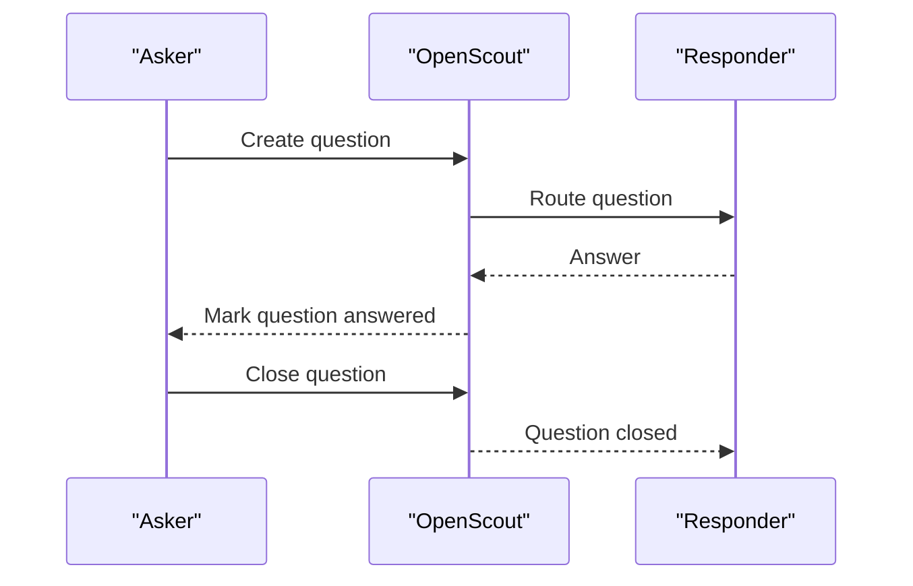
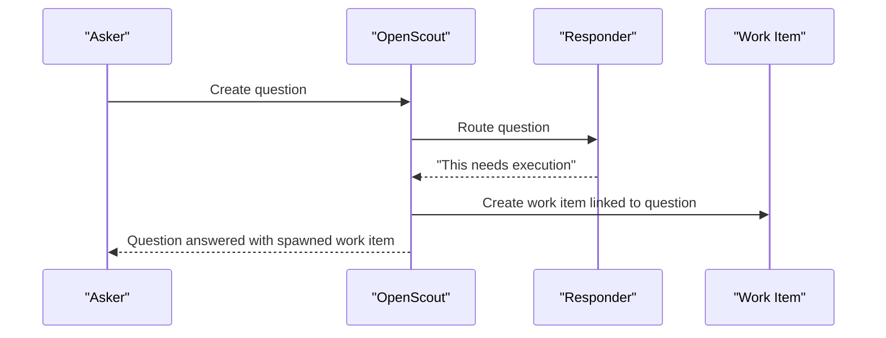
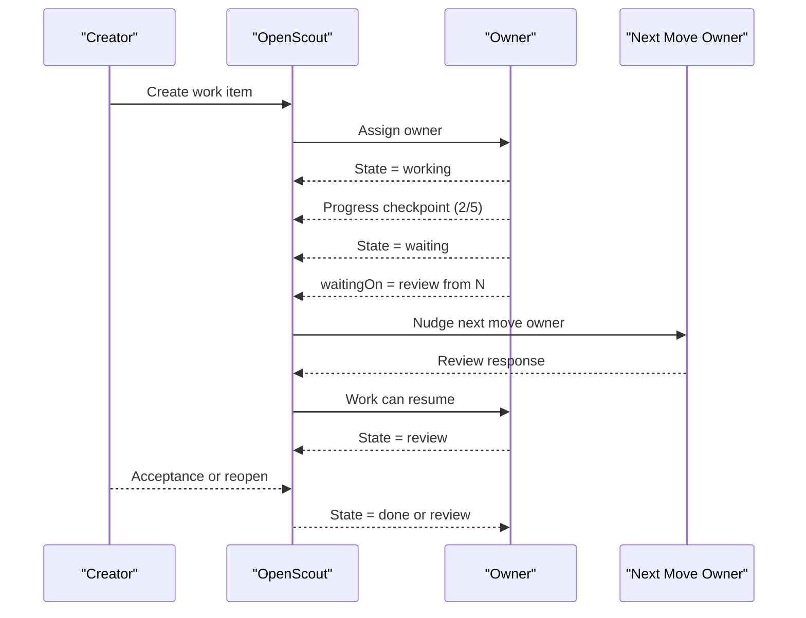

# Collaboration Workflows V1

## Thesis

V1 does not try to solve the entire ontology of collaboration.

It defines two canonical collaboration workflows that cover the current OpenScout surface
area well enough to remove silent ambiguity:

- `question`
- `work_item`

These are peers, not stages in one ladder.

- A question is an information-seeking interaction.
- A work item is a durable unit of execution and coordination.

Questions can stay standalone, attach to work items, or spawn work items. Work items can
progress independently of request-response semantics.

## Why This Split

The current broker model is strong at durable conversation and invocation tracking, but it
does not yet express the semantic layer above it:

- some interactions only need an answer
- some interactions need ownership, waiting, review, and completion
- some interactions start as questions and reveal real execution work

Trying to force all of those into one noun creates either ceremony or ambiguity.

## Canonical Entities

### Question

Use a question when the primary goal is getting information, clarification, or a short
judgment.

Core state:

- `open`
- `answered`
- `closed`
- `declined`

Important notes:

- A question can be closed directly after an answer.
- A question can remain open after an answer if the asker is not satisfied yet.
- A question can spawn a work item if the answer reveals real execution work.

### Work Item

Use a work item when the primary goal is durable execution, progress tracking, or
coordination across turns.

Core state:

- `open`
- `working`
- `waiting`
- `review`
- `done`
- `cancelled`

Important notes:

- `waiting` is preferred to `blocked` as the canonical noun.
- A work item can be self-originated, requested by another party, or created from a
  question.
- Progress is optional but first-class. "2/5 complete" is a work item concern, not a
  question concern.

## Acceptance Is Separate

Acceptance is orthogonal to workflow state.

That means:

- a question can be `answered` but not yet `closed`
- a work item can be `review` with `acceptanceState=pending`
- a self-driven work item can use `acceptanceState=none`

This avoids collapsing "I replied" into "the other party agrees we are done."

## Minimal Required Fields

Both collaboration kinds should support:

- `id`
- `title`
- `createdById`
- `ownerId`
- `nextMoveOwnerId`
- `createdAt`
- `updatedAt`

Work items may additionally carry:

- `waitingOn`
- `progress.completedSteps`
- `progress.totalSteps`
- `progress.summary`

## V1 Invariants

1. Every non-terminal collaboration record must have a `nextMoveOwnerId`.
2. `waiting` is only valid for `work_item`.
3. A `waiting` work item must name `waitingOn`.
4. Acceptance is optional and should only be used when a requester or reviewer exists.
5. Questions do not accumulate long-running execution state. If the interaction turns into
   durable execution, create or link a work item.

## Question Sequence

### Question That Spawns Work

## Work Item Sequence

## Sweeper

The sweeper exists as an insurance policy, not as a planner.

Its job is to periodically inspect stale non-terminal collaboration records and nudge the
current `nextMoveOwnerId`.

Rules:

- do not invent new work
- do not reinterpret goals
- do not ping everyone in the thread
- only ask the current next move owner for a state transition

Suggested v1 behavior:

- stale `question.open`: ask the responder to answer or decline
- stale `question.answered`: ask the asker to close or reopen
- stale `work_item.working`: ask the owner for progress or a waiting transition
- stale `work_item.waiting`: ask the `nextMoveOwnerId` to answer the dependency
- stale `work_item.review`: ask the reviewer to accept or reopen

## Scope Cuts For V1

Explicitly out of scope for the first implementation:

- arbitrary user-defined workflows
- rich hierarchy beyond simple parent-child linking
- full dependency graph semantics
- mandatory milestone planning
- planner-like sweeper behavior
- universal acceptance on every interaction

## Future Direction

The future direction is configurable workflows for humans and agents, but they should sit
on top of stable protocol semantics rather than replacing them.

That means:

- keep canonical collaboration kinds stable
- keep required semantics stable
- allow user-facing workflow aliases and presets later

The protocol should stay interoperable even when different projects want different labels.
