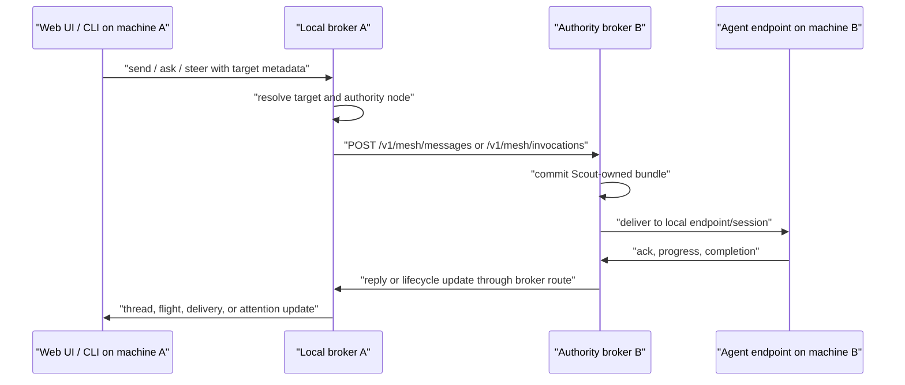

# SCO-046: Cross-Machine Agent UI And Steering

## Status

Proposed.

## Proposal ID

`sco-046`

## Intent

Define the product and implementation contract for operating Scout agents across
multiple machines from the web and companion surfaces.

The goal is not just to show that another node exists. The operator should be
able to see remote machines, understand which agents and work live there, send
messages or asks through broker-owned routes, steer active work, and recover
from routing failures without dropping into ad hoc CLI discovery.

## Context

Solo mode now has enough shape that the next product gap is mesh operation. The
transport plan in [`sco-021`](./sco-021-openscout-mesh-cloudflare-iroh.md)
defines how brokers discover and forward to each other. The current web UI has a
Mesh surface, a Fleet/Agents surface, agent detail views, threads, and operator
attention concepts, but these still read mostly like single-machine tools:

- Mesh is primarily a topology and reachability diagnostic.
- Fleet and Agents show machine columns, but the primary workflows still assume
  the local broker is the user's operational home.
- Agent detail and hover cards do not clearly distinguish local authority,
  remote authority, cached remote records, and unavailable routes.
- Steering an active agent means knowing where to send a message or ask, which
  thread or work item it belongs to, and whether the target can actually receive
  it from here.
- Remote observe and terminal-style affordances are not capability-gated
  enough; they can imply control the current route does not have.

This spec fills the product layer between mesh transport and the existing
thread/work/agent surfaces.

## Product Thesis

Machines must become a first-class operating dimension, but not the primary
mental model for all work.

The operator thinks in terms of agents, work, and threads. The system must still
make node authority visible whenever it affects what the operator can do:

- Which machine owns this agent?
- Is that machine reachable now?
- Which actions can be sent through the broker route?
- Is this state live, last-seen-expired, cached, or observed from a remote harness?
- If a route fails, what can the operator do right now?

`Mesh` should remain the reachability and topology surface. `Fleet`, `Agents`,
`Threads`, and `Work` should become the surfaces where cross-machine operation
and steering happen.

## Scope

In scope:

- web UI information architecture for cross-machine operation
- node, agent, route, action, and steering read models
- remote-safe agent detail behavior
- composer behavior for remote messages, asks, and steering notes
- capability-gated observe, wake, unblock, and terminal affordances
- failure states and no-dead-end recovery actions
- implementation phases and acceptance criteria

Out of scope:

- Iroh, Cloudflare, Tailscale, or relay transport internals
- exactly-once delivery, global consensus, or replicated transcripts
- enterprise RBAC, compliance, or untrusted multi-tenant claims
- importing external harness transcripts as Scout-owned messages
- making `oscout.net` required for solo or peer mesh operation

## Product Model

### Surfaces

The recommended product split is:

| Surface | Job |
| --- | --- |
| Home | Roll up active work, attention, and recent cross-machine activity. |
| Fleet | Operate across agents and work, grouped or filtered by machine. |
| Agents | Inspect and steer one agent, local or remote. |
| Threads | Communicate in the canonical broker conversation. |
| Work | Follow work items, flights, progress, waiting state, and review. |
| Mesh | Diagnose reachability, discovery, entrypoints, and peer health. |
| Observe | Inspect harness-owned material when available, clearly marked observed. |

Mesh should not be the only place a remote agent can be acted on. If a remote
agent appears in Fleet, the operator must be able to open it, message it, ask it
to work, and inspect route state from there.

### Nouns

Use these UI nouns consistently:

- **Machine**: human-facing label for a Scout node in the UI.
- **Node**: protocol and diagnostic label for broker authority.
- **Agent**: stable addressable identity.
- **Session**: concrete harness lifecycle attached to an endpoint.
- **Route**: broker-owned path from the current operator context to the target.
- **Thread**: canonical broker conversation container.
- **Work**: owned execution state, including work items, invocations, and
  flights.

Avoid exposing "peer broker" as a primary UI noun outside diagnostics. It is a
delivery and authority handoff detail.

### Scope

Every primary page should support the same machine scope model. The operator is
not choosing between "local" and "mesh" as product modes; they are choosing
whether the current view is scoped to a machine.

The first route model should be:

- no `machineId`: show the current broker's known operating network
- `machineId=<nodeId>`: show records whose authority, owner, or route context is
  attached to that node
- `machineId=<localNodeId>`: the local-machine view, not a separate product mode

This scope should appear as a global page control, but the value must also live
in the route so links, reloads, Ranger navigation, and mobile handoff preserve
the same view. A persisted preference can choose the default on fresh page
loads, but it should not hide the current route scope.

The scope control should use machine names in the UI and node ids in data. Each
page interprets the same scope in its own domain:

| Page | Unscoped | Machine-scoped |
| --- | --- | --- |
| Home | Active work and attention across known machines. | Active work and attention for one machine. |
| Fleet | All agents and work the broker can see. | Agents and work owned by or routed to one machine. |
| Agents | All visible agents. | Agents whose `authorityNodeId` or `homeNodeId` matches the machine. |
| Threads | Threads across the operating network. | Threads with a participant or authority on the machine. |
| Work | Work items and flights across machines. | Work owned by agents on the machine or blocked on that machine. |
| Mesh | Topology for the network. | Diagnostics for the selected node. |
| Observe | All observable local/remote summaries with capability gating. | Observed material advertised for that machine only. |

Scoped routes must not rely on body text. Any send, ask, steer, or route
resolution started from a scoped page should pass the machine id as structured
routing context or as a node qualifier. That makes duplicate handles such as
`@hudson` on two machines resolvable without teaching the operator a long
selector first.

### Machine-To-Machine Communication

Cross-machine operation is broker-to-broker. An agent should talk to its local
broker. It should not need to open a direct session to an external broker just
because the target agent lives on another machine.

The normal path is:



The remote broker is the authority for its local agents. The local broker plans
delivery, forwards the Scout-owned bundle, and records the handoff/lifecycle
state so the UI can show "accepted locally", "handed to peer", "target
acknowledged", and "completed" as different states.

Tailscale is a discovery and reachability option, not a required product mode.
On the same Wi-Fi or LAN, brokers can communicate directly over ordinary HTTP if
the remote broker is bound to a reachable address and the local broker knows
that address through a seed or discovered node record. The product route ladder
is:

1. `solo`: same-machine loopback or Unix socket.
2. `LAN`: same Wi-Fi or Ethernet, using `.local`, local DNS, or private IP.
3. `tsnet`: Tailscale/tailnet reachability for phones, off-LAN machines, and
   private fallback routing.
4. `oscout.net`: Cloudflare-hosted OpenScout infrastructure for rendezvous,
   relay, push wake, pairing, and fallback when direct routes are unavailable.

These are route tiers, not mutually exclusive app modes. A node may advertise
multiple endpoints at the same time, and route selection should prefer the
closest, clearest boundary that works: `solo`, then `LAN`, then `tsnet`, then
`oscout.net`. Same-network traffic should not hop through Tailscale or
`oscout.net` when a LAN route is healthy. Tailscale should remain available for
natural phone/off-LAN pickup, but it should not become the default path for
nearby machines. `oscout.net` is OpenScout-owned but Cloudflare-hosted and less
familiar than Tailscale, so the UI should treat it as the most mediated tier.

The current documented discovery paths are:

- Tailscale peer probing, when Tailscale is installed and running
- manually configured seed URLs such as `OPENSCOUT_MESH_SEEDS=http://host:4080`
- future or optional rendezvous records, which still only publish presence and
  entrypoints

So the practical answer is: same network should not require Tailscale for the
actual communication path. Without Tailscale or another discovery mechanism,
the user still needs to provide a reachable broker URL or import a node record.
Tailscale makes discovery and naming easier, especially across networks, but the
broker route should stay transport-pluggable across direct LAN HTTP, Tailscale,
Iroh, Cloudflare Tunnel fallback, and manually seeded URLs.

## Core User Stories

### See The Mesh As An Operating Fleet

As an operator, I can open Fleet and see all known machines with:

- machine name and local or remote status
- reachability state and last seen time
- transport summary, such as local, tailnet, iroh, tunnel, or manual seed
- agent counts by working, available, offline, and attention
- active asks and waiting work on that machine
- Scout version and basic host facts when the node advertises them

The default sort should prioritize active and actionable work over topology:

1. needs attention
2. working
3. reachable with available agents
4. last-seen-expired or unreachable
5. empty discovered machines

### Open A Remote Agent

As an operator, I can open a remote agent and immediately understand:

- the agent handle and fully qualified selector
- owning machine and authority node
- current route state from this machine
- harness, model, project, branch, cwd, and session when available
- active task, active flight, or linked work item
- what actions are currently available

The page must not silently treat remote agents like local agents. The header
should show a machine chip, route state, and last refresh time whenever the
agent's authority node is not local.

### Message Or Ask A Remote Agent

As an operator, I can send a note or ask a remote agent for work without knowing
which machine owns it.

The UI submits explicit target metadata to the local broker. The broker resolves
authority, plans peer delivery when needed, and returns durable ids:

- `conversationId`
- `messageId`
- `invocationId` when an ask is created
- `flightId` when work lifecycle is tracked
- delivery state, including peer handoff state when applicable

The UI must distinguish:

- broker accepted the request
- peer broker accepted authority handoff
- target endpoint acknowledged
- work started
- work completed, failed, cancelled, or entered waiting

### Steer Active Work

As an operator, I can steer an active remote agent from the agent detail, thread,
or work view.

For v1, "steer" means posting broker-owned guidance into the active work context
without claiming hard remote process control:

- If the agent has an active work item, steering attaches to that work item and
  its thread.
- If the agent has an active flight but no work item, steering attaches to the
  flight's conversation.
- If neither exists, steering is a normal DM or ask to the target agent.

Steer items should follow the attention vocabulary from
[`sco-044`](./sco-044-operator-attention-policy-and-progress-monitoring.md):

- `fyi`: context only
- `consult`: feedback with a default path
- `steer`: direction that may change course but does not block by itself
- `unblock`: true waiting state requiring operator input

The composer should make default-on-silence clear for consult and steer. If the
operator sends "continue with option B unless you object", the work remains
owned by the agent unless it explicitly enters `waiting`.

### Diagnose Remote Failure

As an operator, if a remote action cannot be completed, I see the exact state and
at least one path forward:

- retry route
- discover peers
- open Mesh diagnostics for that node
- copy the fully qualified selector
- open the thread or work item that contains the failed delivery
- mark or dismiss the attention item when no immediate fix exists

No automatically surfaced remote failure row, card, banner, or badge may be a
dead end. This follows [`no-dead-end-ui.md`](./no-dead-end-ui.md).

## Information Architecture

### Fleet

Fleet becomes the primary cross-machine operating surface.

Required controls:

- search across agent, task, project, branch, machine, harness, and selector
- machine scope control with all-machines and one-machine states
- machine filter with local, remote, reachable, last-seen-expired, and unreachable states
- status filters for working, available, offline, waiting, and failed
- grouping toggle: by machine, by project, by harness, by active work
- sort controls for attention, activity, route health, and last seen

Required row or card fields:

- agent identity and handle
- machine chip
- route status
- active task or latest broker-visible state
- project and branch
- harness and model
- active flight or work count
- last activity and last route update

Required actions:

- open agent
- open thread
- send note
- ask
- request status
- retry failed delivery when a failed delivery is selected
- open Mesh diagnostics for the owning machine

### Mesh

Mesh remains the topology and diagnostics view.

It should answer:

- What machines are known?
- How were they discovered?
- Which entrypoints are available?
- Which transports are reachable?
- What does this machine advertise?
- Why is a node last-seen-expired, loopback-only, local-only, or unreachable?

Mesh should link into Fleet and Agent detail for operation. For example, a node
selection can show "Open agents on this machine" and "Open active work on this
machine", but the main work happens outside Mesh.

### Agent Detail

Agent detail must be remote-safe.

Header:

- agent name and handle
- fully qualified selector with copy affordance
- machine chip
- route status chip
- authority node and last seen detail in a compact disclosure

Tabs or sections:

- **Overview**: current state, active task, route capability matrix
- **Thread**: canonical broker conversation with this agent
- **Work**: active and recent work items, invocations, and flights
- **Observe**: harness-owned observed material, if available
- **Route**: delivery attempts, authority node, entrypoints, and diagnostics

Action bar:

- send note
- ask
- steer active work
- request status
- wake or start session when supported
- open terminal or takeover only when the route advertises that capability

Remote observe and terminal actions must be disabled with actionable copy when
the current route cannot support them.

### Threads

Thread pages should show machine and route context for remote participants.

For a DM with a remote agent:

- show the remote machine in the thread header
- keep messages in the canonical conversation id returned by the broker
- render peer handoff and delivery failures as lifecycle state, not as hidden
  background errors
- let the composer target the current thread participant by structured metadata

For a channel with multiple agents:

- require explicit targets for asks
- require an explicit channel for group coordination
- avoid routing solely from body mentions
- show target chips before send when a message will create directed deliveries

### Work

Work views should group active work across machines and expose steering at the
work level.

Required fields:

- owner agent and machine
- current lifecycle state
- waiting owner when blocked
- latest progress snapshot
- linked thread
- route and delivery state for remote results

Required actions:

- open work
- open owner agent
- open thread
- steer
- answer or resolve unblock when applicable
- retry or dismiss failed delivery when applicable

## Read Models And API Shape

The broker remains the canonical writer for Scout-owned coordination records.
The web server may project convenience read models, but it should not invent a
second authority path.

### Node Operational Summary

Add or project a read model shaped like:

```ts
export interface NodeOperationalSummary {
  nodeId: string;
  meshId: string | null;
  name: string;
  displayName: string;
  isLocal: boolean;
  authorityState: "local" | "reachable" | "last_seen_expired" | "unreachable" | "unknown";
  lastSeenAt: number | null;
  lastRouteCheckAt: number | null;
  brokerUrl: string | null;
  transports: Array<{
    tier: "solo" | "LAN" | "tsnet" | "oscout.net";
    kind: "local" | "http" | "tailnet" | "iroh" | "cloudflare_tunnel" | "manual_seed" | "mobile_pairing";
    state: "ready" | "degraded" | "unreachable" | "unknown";
    label: string;
  }>;
  host?: {
    scoutVersion?: string;
    os?: string;
    arch?: string;
    cpuCores?: number;
    memoryGb?: number;
    storageCapacityGb?: number;
    network?: string;
  };
  counts: {
    agents: number;
    working: number;
    available: number;
    offline: number;
    activeFlights: number;
    waiting: number;
    needsAttention: number;
  };
}
```

### Agent Route Summary

Extend the agent projection, or add a parallel map keyed by agent id:

```ts
export interface AgentRouteSummary {
  agentId: string;
  selector: string;
  authorityNodeId: string | null;
  authorityNodeName: string | null;
  isRemote: boolean;
  routeState:
    | "local"
    | "routable"
    | "peer_handoff"
    | "queued"
    | "last_seen_expired"
    | "unreachable"
    | "ambiguous"
    | "unsupported";
  lastResolvedAt: number | null;
  lastDeliveryState: string | null;
  capabilities: {
    message: boolean;
    ask: boolean;
    reply: boolean;
    observe: boolean;
    wake: boolean;
    unblock: boolean;
    terminal: boolean;
    fileOpen: boolean;
  };
  diagnostics: Array<{
    code: string;
    severity: "info" | "warning" | "error";
    summary: string;
    actionLabel: string | null;
    actionRoute: string | null;
  }>;
}
```

`message` and `ask` capabilities mean "the broker can attempt this route", not
"completion is guaranteed".

### Steering Request

The UI should submit steering through the broker, not directly to a remote web
server.

```ts
export interface AgentSteeringRequest {
  targetAgentId: string;
  targetSelector?: string;
  machineId?: string;
  intent: "fyi" | "consult" | "steer" | "unblock";
  body: string;
  context:
    | { kind: "agent" }
    | { kind: "conversation"; conversationId: string }
    | { kind: "flight"; flightId: string; conversationId?: string }
    | { kind: "work_item"; workId: string; conversationId?: string };
  defaultAction?: {
    label: string;
    executeAfterMs?: number;
  };
}
```

The broker response should include:

- canonical `conversationId`
- `messageId`
- optional `invocationId`
- optional `flightId`
- delivery ids and current delivery states
- route diagnostics when not immediately deliverable

## State And Failure Vocabulary

Surfaces should share these remote route states:

| State | Meaning | Minimum action |
| --- | --- | --- |
| `local` | Agent authority is this broker. | Open agent or thread. |
| `routable` | Remote authority has a known reachable route. | Send note or ask. |
| `peer_handoff` | Local broker handed authority to a peer broker. | Follow flight or delivery. |
| `queued` | Delivery is pending retry or worker claim. | Follow, retry now, or cancel if supported. |
| `last_seen_expired` | Node was known but has exceeded freshness TTL. | Discover peers or retry route. |
| `unreachable` | No known current entrypoint can be reached. | Open Mesh diagnostics, retry, copy selector. |
| `ambiguous` | The selector maps to multiple candidates. | Choose a candidate. |
| `unsupported` | The requested action needs a missing route capability. | Show the supported alternatives. |

Common diagnostics:

- `mesh_local_only`
- `mesh_loopback`
- `peer_stale`
- `peer_unreachable`
- `authority_mismatch`
- `agent_unreachable`
- `session_missing`
- `session_harness_mismatch`
- `capability_missing`
- `host_permission_waiting`
- `delivery_retrying`
- `delivery_dead_lettered`
- `version_mismatch`

Every diagnostic rendered unbidden must carry a direct action, a path forward,
copyable detail, or dismiss.

## Capability-Gated Actions

Remote actions should be available only when the current route supports them.

| Action | Required capability | Notes |
| --- | --- | --- |
| Send note | `message` | Creates or appends to broker thread. |
| Ask | `ask` | Creates invocation and flight. |
| Steer active work | `message` plus active work or flight context | Does not imply process control. |
| Request status | `ask` or `message` | Prefer ask when a reply is expected. |
| Wake session | `wake` | Must report concrete wake/session result. |
| Answer question | `unblock` | Requires broker-owned question or unblock request. |
| Observe harness | `observe` | Observed material stays harness-owned. |
| Terminal takeover | `terminal` | Local-only unless a remote terminal bridge exists. |
| Open file/path | `fileOpen` | Local-only unless the remote host advertises a file bridge. |

If an action is unavailable, the disabled state should name the missing
capability and offer the nearest supported path. Example: "Terminal is not
available through this route. Open thread or ask the remote agent for status."

## Data Ownership And Trust

This UI must preserve the existing data boundary:

- Scout-owned records can be rendered, replayed, and forwarded across mesh.
- External harness transcripts remain observed source material.
- Remote observed material may be linked, summarized, or fetched through an
  adapter route when explicitly supported, but it must not be bulk-imported as
  Scout messages.
- Cloud rendezvous, when enabled, is directory and presence infrastructure, not
  broker state authority.

Trust posture remains high-trust local developer pilots. The UI can assume the
operator intentionally paired or discovered peers, but it must not imply
enterprise-grade policy, tenant isolation, or guaranteed delivery.

## Implementation Plan

### Phase 1: Read Model And Visual Authority

Goal: make remote authority visible and queryable without changing transport.

Tasks:

- add `NodeOperationalSummary` projection in the web server or broker read model
- add `AgentRouteSummary` projection keyed by agent id
- add a shared route-level machine scope model for Home, Fleet, Agents, Threads,
  Work, Mesh, and Observe
- include authority node, machine label, route state, and capabilities in Fleet
  and Agent views
- show machine chips in agent rows, hover cards, thread headers, and work rows
- add shared route status components for local, routable, last-seen-expired, unreachable,
  and unsupported

Exit criteria:

- two-machine fixtures can render local and remote agents distinctly
- scoping a page to one machine produces stable links and survives reload
- opening a remote agent shows the owning machine and route state
- unavailable remote actions are disabled with an actionable explanation

### Phase 2: Fleet As Cross-Machine Operations

Goal: Fleet becomes the primary surface for remote agents and active work.

Tasks:

- add machine grouping and filters to Fleet/Agents
- wire the shared machine scope control into Fleet, Agents, Threads, and Work
- sort active and attention-needed remote work above passive topology
- add row actions for open agent, open thread, send note, ask, request status,
  and open Mesh diagnostics
- make Mesh node detail link to the Fleet slice for that machine
- keep Mesh focused on diagnostics and entrypoint health

Exit criteria:

- an operator can find a remote working agent without opening Mesh first
- Mesh and Fleet link to each other without duplicating the same job

### Phase 3: Remote Steering Composer

Goal: send broker-owned guidance into active remote work.

Tasks:

- add an agent/work/thread steering composer with `fyi`, `consult`, `steer`,
  and `unblock` intents
- resolve active work context before falling back to DM
- submit explicit target metadata and context to the broker
- render broker receipt, peer handoff, target acknowledgement, and terminal
  result as separate states
- reuse thread canonicalization from SCO-029 so optimistic rows survive reload

Exit criteria:

- steering an active remote flight produces a durable message in the correct
  thread or work context
- peer handoff and final result are separately visible
- failed route states show retry or diagnostics actions

### Phase 4: Cross-Machine Attention

Goal: attention and unblocks work across machines.

Tasks:

- project remote work waiting, failed delivery, and host permission states into
  the operator attention model
- attach attention items to machine and route summaries
- respect the SCO-044 attention policy for web, desktop, mobile, and digest
- avoid mobile push payload detail beyond opaque ids

Exit criteria:

- a blocked remote agent appears in Home/Fleet attention with machine context
- answering or dismissing follows the no-dead-end rule

### Phase 5: Observe And Takeover Capabilities

Goal: add deeper remote inspection only where the route supports it.

Tasks:

- define observe capability for remote harness summaries and tail cursors
- define terminal/file-open capability separately from message/ask reachability
- gate Agent detail tabs and actions by advertised capability
- keep observed harness detail marked as observed, not Scout-owned messages

Exit criteria:

- remote observe never implies full transcript replication
- terminal and file actions are impossible to invoke without route capability

## Acceptance Criteria

- With two brokers in one mesh, the web UI on machine A shows machine B as a
  distinct machine with remote agents grouped or filterable by machine.
- Every primary page can be unscoped across the visible operating network or
  scoped to one machine by route-level `machineId`.
- A remote agent detail page shows authority machine, route state, selector,
  supported actions, active work, and last seen data.
- Sending a message to a remote agent uses explicit target metadata and returns
  a durable broker receipt.
- Sending an ask to a remote agent exposes broker accepted, peer handoff, target
  acknowledgement, active work, and terminal result as distinct states.
- Steering active remote work attaches to the active work or flight context
  instead of creating an unrelated thread.
- Unreachable, last-seen-expired, unsupported, and ambiguous remote states all provide an
  actionable next step or dismiss.
- Mesh remains useful as diagnostics, but it is not required for routine remote
  agent operation.
- No UI path imports raw external harness transcripts as Scout-owned messages.
- Solo mode remains fully functional with no mesh or hosted rendezvous.

## Verification

Unit tests:

```bash
bun test packages/web/client/lib/router.test.ts
bun test packages/web/client/lib/api.test.ts
bun test packages/web/server/create-openscout-web-server.test.ts
```

New or expanded tests should cover:

- node and agent route projection for local, remote, last-seen-expired, and unreachable
  states
- Fleet grouping by machine
- route-level machine scope behavior across reload and navigation
- route capability gating for agent actions
- steering context selection: work item, flight, conversation, fallback DM
- canonical conversation reconciliation after remote sends

Manual smoke:

```bash
# On both machines:
scout doctor
scout whoami
scout mesh discover
scout who

# From machine A:
scout send --to <remote-agent-selector> "status check"
scout ask --to <remote-agent-selector> "reply with your current task and machine"
```

Then verify in the web UI on machine A:

- the remote machine appears in Fleet
- the remote agent page shows machine and route state
- the thread shows the message or ask receipt
- peer handoff and target acknowledgement are visible when available
- disabling the remote broker changes the route state to last-seen-expired or unreachable
  with recovery actions

## Decision Trace

This section is the memory of the product discussion. It is intentionally not an
open-question parking lot: when a choice is still unstable, resolve it in chat
and update this trace with the current decision and why we made it.

### Mesh Discovery Landing

After a successful mesh discovery, Home should surface a short "new machine
joined" memory card first, with primary actions to open the machine-scoped Fleet
slice and Mesh diagnostics.

Rationale:

- Home is the operator's orientation surface and should explain that the network
  changed.
- Fleet is the default work surface once the operator decides to act.
- Agents remains a drill-in/library surface, not the default post-discovery
  destination.

### Route Tier Trust Ladder

Cross-machine reachability should use the route ladder `solo`, `LAN`, `tsnet`,
then `oscout.net`. The ladder is ordered by understandable operator boundary,
not just technical security. `solo` stays on the same machine. `LAN` stays on
the nearby physical network. `tsnet` is private and useful for phones or
off-LAN machines, but it depends on Tailscale identity and control-plane
behavior. `oscout.net` is OpenScout-owned Cloudflare-hosted infrastructure for
rendezvous, relay, push wake, pairing, and fallback, so it is the most mediated
tier.

Route tiers are not global product modes. A node can advertise multiple
endpoints, and the broker should choose the first healthy endpoint in preference
order. Same-network Mac-to-Mac traffic should not leave the LAN just because a
tailnet URL exists. Tailscale remains available as a natural route for mobile
and off-LAN reachability. `oscout.net` should be explicit in UI copy as an
OpenScout relay/fallback path rather than the normal mesh path.

Rationale:

- The operator can understand and debug the nearest boundary first.
- Local traffic should stay inside local boundaries whenever a direct route is
  healthy.
- Tailscale is valuable for phones and roaming machines without making it the
  canonical route for nearby peers.
- `oscout.net` is ours, but Cloudflare-hosted and less familiar than Tailscale,
  so it should be treated as the least-default tier.

### Remote Observe Before A Bridge

Before a dedicated observe bridge exists, remote observe should be limited to
broker-owned summaries and explicitly advertised observed material. It may show
agent state, active work, last activity, recent Scout messages, route status,
and linked observed artifacts when the remote node advertises them, but it must
not promise live transcript parity or import raw external harness transcripts as
Scout messages.

Rationale:

- The broker can coordinate Scout-owned records safely today.
- External transcripts remain harness-owned source material.
- A dedicated observe bridge can later add live remote detail behind explicit
  capability gates.

### Request Status

Request status should start as a normal ask composer preset with structured
routing context, not a separate broker primitive.

Rationale:

- The desired outcome is a reply, so the ask/invocation lifecycle already fits.
- A preset gives the UI a consistent button without inventing another delivery
  path.
- If usage proves common enough, the broker can later add a thin action alias
  that still creates a normal invocation.

### Remote Wake V1

V1 remote wake should be limited to capability-advertised, broker-mediated wake
attempts for already registered remote agents. It should report accepted,
peer-handoff, target-acknowledged, failed, last-seen-expired, or unsupported states. Process
control, terminal takeover, host file actions, and anything requiring new host
permission should wait for an explicit host permission capture path.

Rationale:

- Wake is operationally useful only when the remote node says it supports it.
- Permission-sensitive operations need an auditable human path on the authority
  machine.
- A failed or unsupported wake should still produce useful route diagnostics.

### Route Capability Summaries

For the first implementation, route capability summaries should live in web read
models derived from protocol records and broker snapshots. The UI should render
capabilities as read-model facts, while the protocol keeps durable primitives:
agents, nodes, endpoints, deliveries, invocations, flights, conversations, and
work items. Promote a capability summary into protocol only after more than one
client or transport needs the same persisted contract.

Rationale:

- Read models let the UI iterate quickly without hardening premature protocol
  shape.
- Protocol records stay focused on durable coordination facts.
- Promotion remains available once the capability vocabulary stabilizes.
