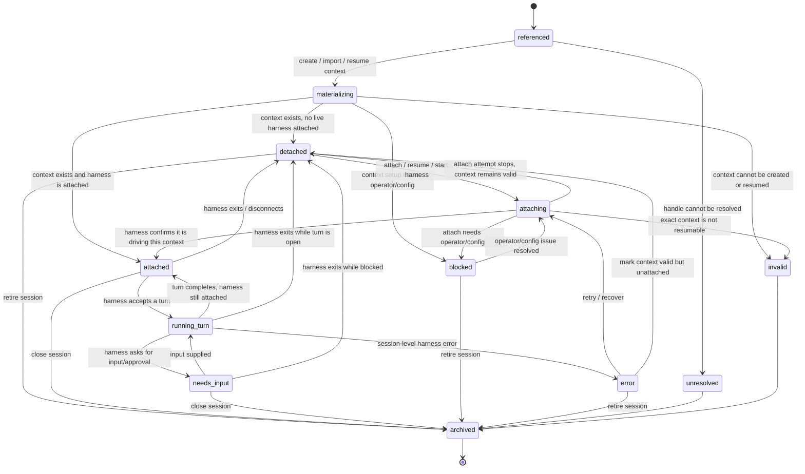
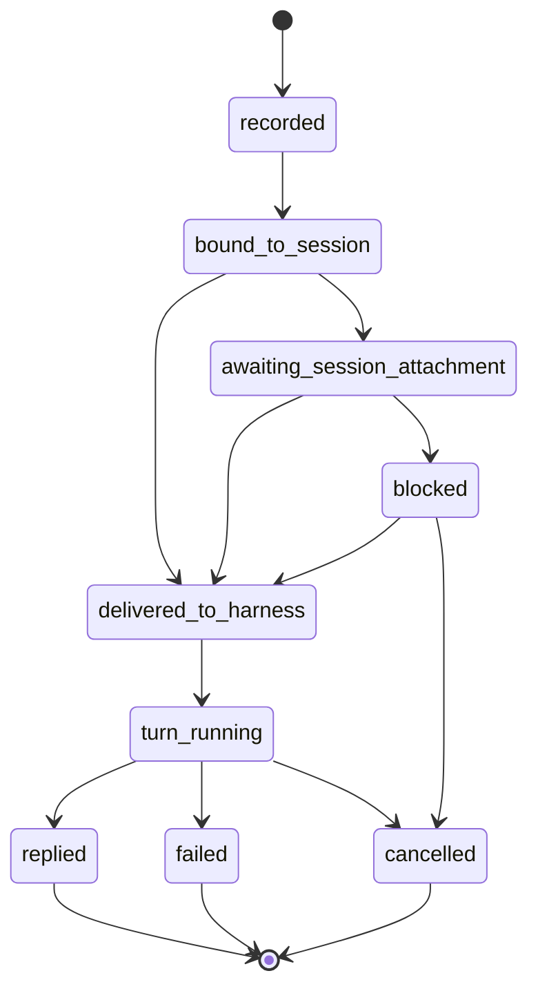

# SCO-079: Agent Session / Harness State Machine

## Status

- **Status:** Draft
- **Owner:** OpenScout
- **Scope:** Agent session lifecycle, harness attachment, and how asks/messages reference sessions
- **Intent:** Define the lifecycle of an **agent session** without treating agents as stateful processes and without using message-delivery states as session states.

## Correction from earlier draft

The first draft accidentally described the lifecycle of a message/invocation:

```text
accepted -> resolving -> running -> completed
```

That is not the lifecycle of an agent session. It is the lifecycle of a request using a session.

This document is about the session itself.

## Core model

This proposal intentionally documents **two state machines**:

1. **Agent session lifecycle** — the lifecycle of a harness-backed session context.
2. **Invocation lifecycle** — the lifecycle of a request/message that wants to use a session.

Both are useful. They should not be collapsed into one model. The conceptual mistake to fix is treating an invocation delivery condition as if it were an agent/session state.

Agents are stateless durable identities. They do not become “online,” “offline,” “queued,” or “waiting.”

A session is a concrete harness context. It may or may not currently be attached to a running harness process that can accept work.

```text
agent identity       stable address / capability profile
session              harness context / conversation identity
harness attachment   current ability to drive that session through a running harness
invocation/message   work or payload that may reference a session
```

The key question for session state is:

> Is this session currently attached to a compatible running harness context?

Not:

> Is the agent online?

## Primary state machine: Agent Session

An agent session is best modeled as **a durable session context plus an optional live harness attachment**.


This is the state machine we should rely on for session lifecycle:



### State definitions

| State | Meaning | Invariant |
| --- | --- | --- |
| `referenced` | Scout has a session handle or wants one, but has not proven a harness context exists. | No claim of usable context yet. |
| `materializing` | Scout is creating, importing, or loading the harness context for that session. | A concrete context operation is in progress. |
| `detached` | The session context exists, but no running harness is currently driving it. | Context is valid; attachment is absent. |
| `attaching` | Scout is trying to bind the existing context to a running harness. | There is an attach/resume/start attempt. |
| `attached` | A running harness is currently driving the session context and can accept a turn. | Has a verified harness attachment. |
| `running_turn` | The attached harness is processing one turn in this session. | Exactly one active turn/invocation for the session attachment. |
| `needs_input` | The running turn/session is paused on explicit operator input. | There is a concrete blocker record. |
| `blocked` | Scout cannot create/attach the session without operator/config action. | There is a concrete next action. |
| `error` | A session-level harness error occurred, but the session may be recoverable. | Error is tied to the session/attachment, not merely a message. |
| `unresolved` | The session handle cannot be found or mapped to a context. | No valid context established. |
| `invalid` | The context exists or was requested, but cannot be used under the requested constraints. | Exact resume/fork/etc. is not possible. |
| `archived` | The session is intentionally retired from routing. | Terminal for active routing. |

### The important distinction

`detached` is the state we were previously describing badly as “offline,” “queued,” or “no runnable endpoint.”

The correct meaning is:

> The session context exists, but it is not currently attached to a running harness.

That is a session state, not an agent state and not a message state.

### Minimal transition table

| From | To | Trigger |
| --- | --- | --- |
| `referenced` | `materializing` | Fresh/reuse/fork/existing policy asks Scout to prove or create context. |
| `referenced` | `unresolved` | Exact session handle cannot be found. |
| `materializing` | `detached` | Context exists but no live harness is attached. |
| `materializing` | `attached` | Context exists and harness attaches during creation/resume. |
| `materializing` | `blocked` | Setup needs auth, permission, config, install, or operator action. |
| `materializing` | `invalid` | Context cannot be created/imported/resumed under constraints. |
| `detached` | `attaching` | Resume/start/attach requested. |
| `attaching` | `attached` | Harness adapter confirms it is driving that session context. |
| `attaching` | `detached` | Attach attempt ended without invalidating the context. |
| `attaching` | `blocked` | Attach cannot continue without operator/config action. |
| `attached` | `running_turn` | Harness accepts a turn. |
| `running_turn` | `attached` | Turn completes and harness remains attached. |
| `running_turn` | `needs_input` | Harness emits approval/question/input requirement. |
| `needs_input` | `running_turn` | Input is supplied. |
| `attached`/`running_turn`/`needs_input` | `detached` | Harness exits, disconnects, or is no longer driveable. |
| `error` | `attaching` | Retry/recover. |
| any non-terminal | `archived` | User/policy retires session from active routing. |

## Session policy overlay

Session policy decides which session state transitions are allowed for an invocation.

| Invocation session policy | Meaning | Session lifecycle effect |
| --- | --- | --- |
| `new` | Create a new harness context. | `referenced -> materializing -> attached` when the harness is live; otherwise `referenced -> materializing -> detached`. |
| `reuse` | Use an attached compatible session if one exists; otherwise create/resume one. | `attached -> running_turn`, or `detached -> attaching -> attached`, or `referenced -> materializing` when no context has been proven yet. |
| `existing` | Continue one exact session. | If `attached`, it may become `running_turn`; if `detached`, only exact resume/attach is allowed; if not found, `unresolved`; if not resumable, `invalid` or `blocked`. |
| `fork` | Create a new session from previous context/state. | Source session is read; the new session follows `referenced -> materializing -> attached` or `referenced -> materializing -> detached`. |

## Companion state machine: Invocation / message request

A message or invocation has its own lifecycle. That lifecycle is worth documenting because it answers “what happened to my ask?” It should not reuse session states, because it is not the lifecycle of the session itself.

Minimal invocation lifecycle:



The important bridge is explicit and one-way:

```text
invocation.awaiting_session_attachment
  because session.state is detached | attaching | needs_input | blocked
```

The invocation may be “awaiting session attachment,” but the session is not “queued.” The session is either detached, attaching, needs input, or blocked on operator/config action.

That should produce copy like:

> Session is not attached to a running harness.

not:

> Agent is offline.

## Banned worldview

Do not describe session execution readiness with these concepts:

- agent online/offline
- waiting for target
- queued until online
- message stored for later delivery
- no runnable endpoint

Those may exist as low-level compatibility values or network/machine states, but they are not the product model for agent sessions.

## Compatibility mapping

Existing persisted records should be projected into the session model before rendering.

| Existing value | Projected session state | Notes |
| --- | --- | --- |
| `dispatchOutcome.status = queued_until_online` | `detached` or `attaching` | Use `attaching` only if an attach/resume attempt is active; otherwise `detached`. |
| `dispatchOutcome.reason = no_runnable_endpoint` | `detached` | Better name: `session_not_attached`. |
| `flight.state = waking` | `attaching` | For session display only. |
| `flight.state = queued` | Not a session state | Scheduler/invocation state; project to session only via attachment evidence. |
| `endpoint.state = offline` | `detached` or `stale` | Endpoint registry state, not agent state. |
| `agent_offline` | Avoid | Split into session detached, machine unreachable, peer unreachable, or manual setup required. |

## Proposed persisted shape

Add a session lifecycle projection that can be stored or computed from current records:

```ts
type AgentSessionLifecycleState =
  | "referenced"
  | "materializing"
  | "detached"
  | "attaching"
  | "attached"
  | "running_turn"
  | "needs_input"
  | "blocked"
  | "error"
  | "unresolved"
  | "invalid"
  | "archived";

type AgentSessionLifecycle = {
  sessionId: string;
  agentId: string;
  harness?: string;
  state: AgentSessionLifecycleState;
  attachedEndpointId?: string;
  harnessSessionId?: string;
  currentInvocationId?: string;
  blockerId?: string;
  reason?:
    | "session_not_attached"
    | "attaching_harness"
    | "operator_input_required"
    | "permission_required"
    | "credential_required"
    | "stale_session_reference"
    | "session_not_resumable"
    | "harness_error"
    | "closed_by_operator";
  updatedAt: number;
};
```

## Copy rules

Preferred:

- “Session is not attached to a running harness.”
- “Attaching session to Codex.”
- “Session ready.”
- “Session running a turn.”
- “Session needs approval.”
- “Exact session cannot be resumed.”

Avoid:

- “Agent is offline.”
- “Waiting for target.”
- “Queued until online.”
- “No runnable endpoint.”
- “Message stored; will deliver when online.”

## Implementation plan

1. Introduce a projection helper, e.g. `projectAgentSessionLifecycle(...)`, that derives this state from session records, endpoints, invocations, flights, and blockers.
2. Keep legacy flight/endpoint enums for journal compatibility, but stop rendering them directly in product surfaces.
3. Rename new dispatch metadata from `no_runnable_endpoint` to `session_not_attached` and from `queued_until_online` to an invocation-side state like `awaiting_session_attachment`.
4. Update CLI ask rendering to say “Session is not attached to a running harness.”
5. Update fleet/chat/macOS/mobile surfaces to consume the same projection helper.
6. Add transition tests for session lifecycle separately from invocation lifecycle.
7. Backfill compatibility tests proving old records render through the new vocabulary.

## Acceptance criteria

- There is a distinct session lifecycle projection independent of message/invocation lifecycle.
- User-facing surfaces do not describe agent sessions as offline/online/queued.
- A request aimed at a detached session renders as “Session is not attached to a running harness.”
- Exact-session continuation distinguishes `detached but resumable`, `stale`, and `invalid/not resumable`.
- Invocation state can reference session lifecycle state, but does not become the session lifecycle.
