# OpenScout Actual Onboarding Run

Date: 2026-06-04  
Machine: Art's Mac mini  
Checkout: `/Users/art/dev/openscout` on `feat/web-design-system`

This is the real QA pass, separate from the illustrative onboarding recap in
`docs/onboarding-install-recap.md`.

Before the run, existing Scout-owned state was moved to:

```plaintext
/Users/art/Library/Application Support/OpenScout Actual Run Backups/20260604-153937
```

Claude/Codex harness directories and running harness processes were not removed.

## CLI Run

The CLI pass used the repo-local install path so it exercised this checkout:

```bash
bun install
npm --prefix packages/cli run build
(cd packages/cli && bun link)
scout --help
scout config set name "Art"
scout setup --source-root ~/dev --default-harness codex
scout doctor
scout runtimes
scout whoami
scout who
```

Raw logs:

- [01-repo-install.log](./assets/onboarding-real-run/cli/01-repo-install.log)
- [02-setup.log](./assets/onboarding-real-run/cli/02-setup.log)
- [03-health.log](./assets/onboarding-real-run/cli/03-health.log)
- [04-first-message.log](./assets/onboarding-real-run/cli/04-first-message.log)
- [05-first-message-followup.log](./assets/onboarding-real-run/cli/05-first-message-followup.log)

### Install, Build, Link, Help

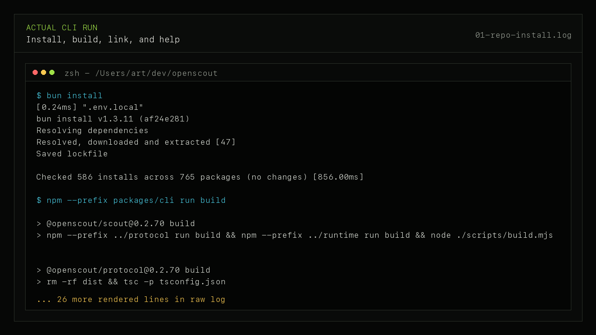

### Setup

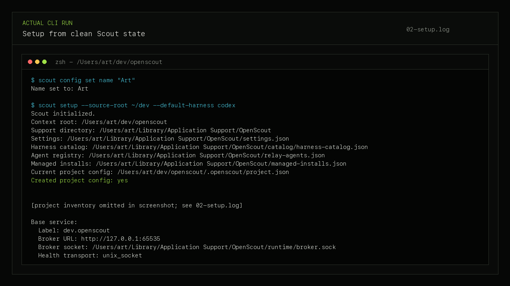

Setup result:

- created `/Users/art/dev/openscout/.openscout/project.json`
- discovered 19 projects
- installed and loaded `dev.openscout`
- found Caddy ready at `/opt/homebrew/bin/caddy`
- detected Claude, Codex, and Pi as ready runtimes

### Doctor And Runtime Health

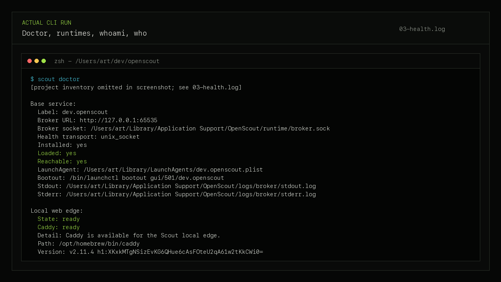

Health result:

- broker reachable at `http://127.0.0.1:65535`
- local edge ready with `scout.local` and `arts-mac-mini.scout.local`
- HTTP listener ready on `127.0.0.1:80`
- `scout whoami` resolved `openscout.feat-web-design-system.arts-mac-mini-local`

### First Message

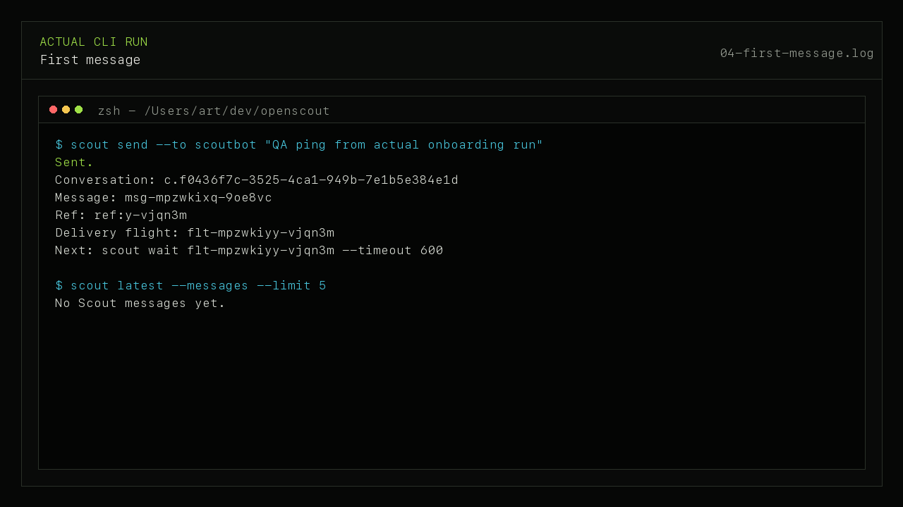

### Delivery Follow-Up

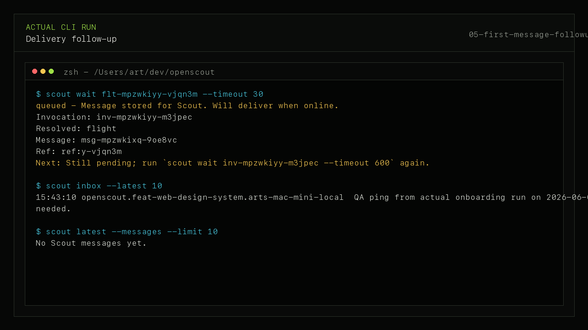

QA note: `scout send --to scoutbot` created a conversation, message, ref, and
delivery flight. `scout wait` reported the delivery as queued because Scoutbot
was offline. `scout inbox --latest 10` showed the message, but
`scout latest --messages --limit 10` still reported `No Scout messages yet`.

## Web Run

After the CLI pass, that generated state was backed up separately under:

```plaintext
/Users/art/Library/Application Support/OpenScout Actual Run Backups/20260604-153937/after-cli-pass
```

Scout-owned state was reset again, then the real web app at
`http://127.0.0.1:3300/` was reloaded and driven through onboarding.

Machine-readable final state:

- [onboarding-state-after-web.json](./assets/onboarding-real-run/web/onboarding-state-after-web.json)

### First-Run Web Open

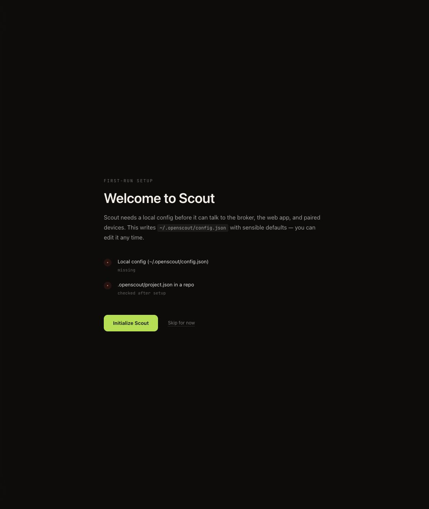

### Identity Step

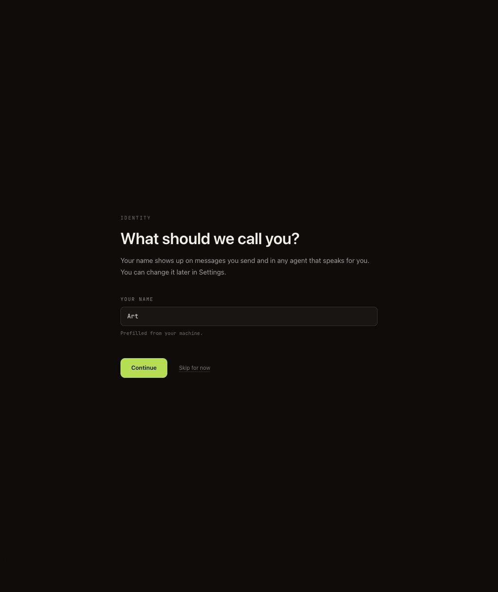

### Project Step

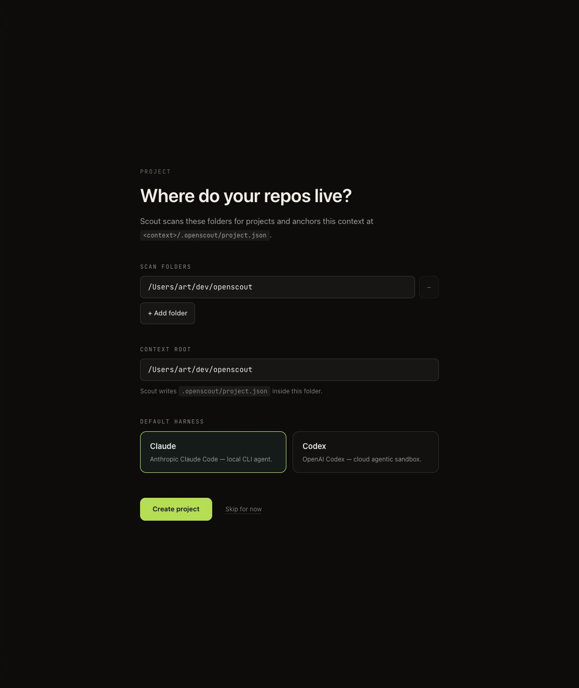

QA notes:

- The scan folder defaulted to the current repo, `/Users/art/dev/openscout`, not
  the broader source root `~/dev`.
- The project step initially selected Claude, even though the intended default
  for this pass was Codex.

### Codex Selected

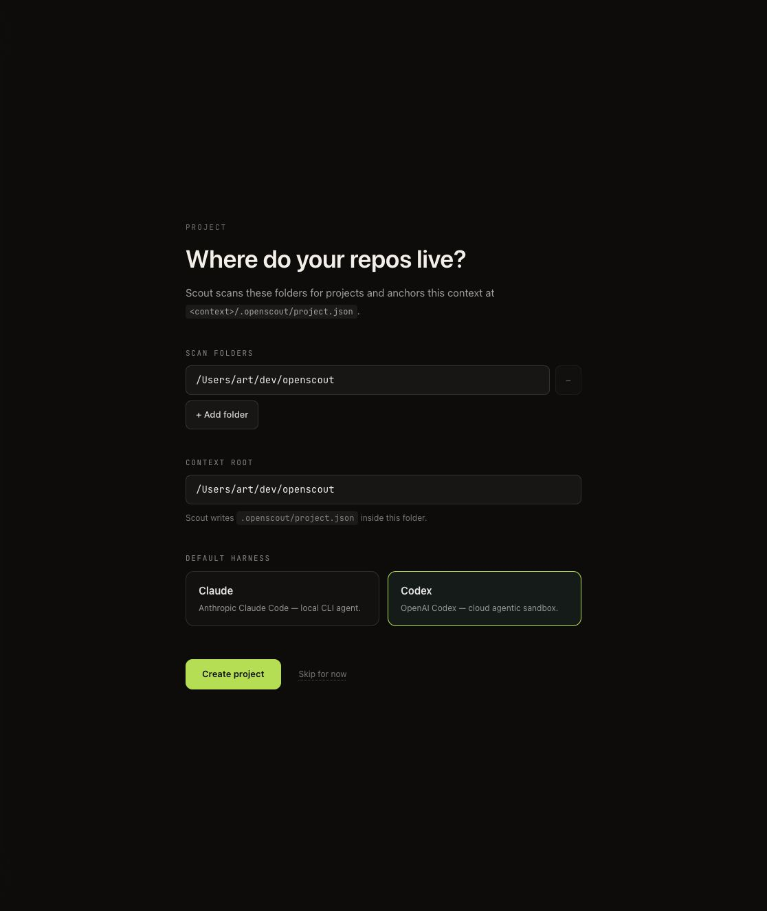

### Project Create Stuck

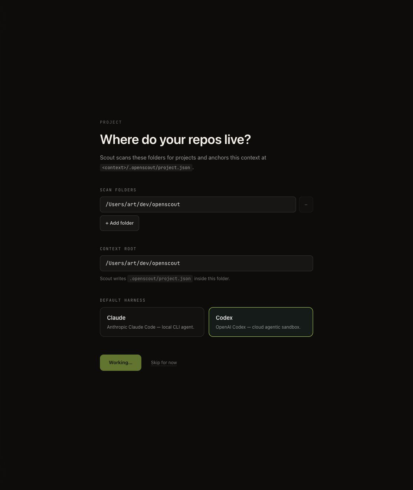

QA note: after clicking `Create project`, the UI stayed on `Working...`.
However, `/api/onboarding/state` reported `needed: false`, `brokerReachable:
true`, `hasReadyRuntime: true`, and `completedAt` set. Reloading the page
unblocked the UI.

### Final Web Home After Reload

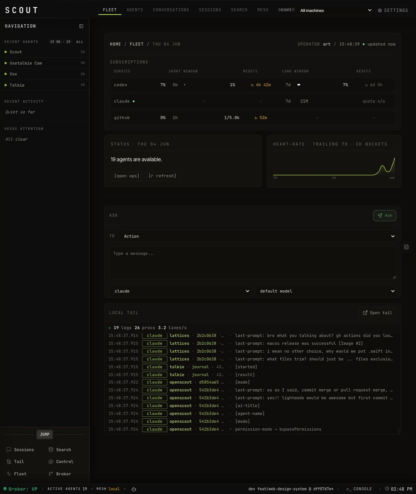

What looked good:

- broker status recovered to `UP`
- subscription table populated
- agent availability showed 19 agents
- chart rendered when activity existed
- plain ask box and embedded local tail were real, populated data

Follow-up notes:

- The ask form default harness showed `claude` even after selecting Codex in
  onboarding.
- The real local tail is much better than the earlier mock table, but it can
  expose noisy `[mode]`, `[agent-name]`, and `last-prompt` rows without much
  summarization.

## Desktop Run

The menu helper was already installed and running after setup:

- [desktop-status.log](./assets/onboarding-real-run/desktop/desktop-status.log)

```plaintext
Installed: yes
Bundle: /Users/art/dev/openscout/apps/macos/dist/OpenScoutMenu.app
Running: yes
Helper: /Users/art/dev/openscout/apps/macos/bin/openscout-menu.ts
```

The full native `OpenScout.app` was launched from:

```plaintext
/Users/art/dev/openscout/apps/macos/dist/OpenScout.app
```

### Native App Open

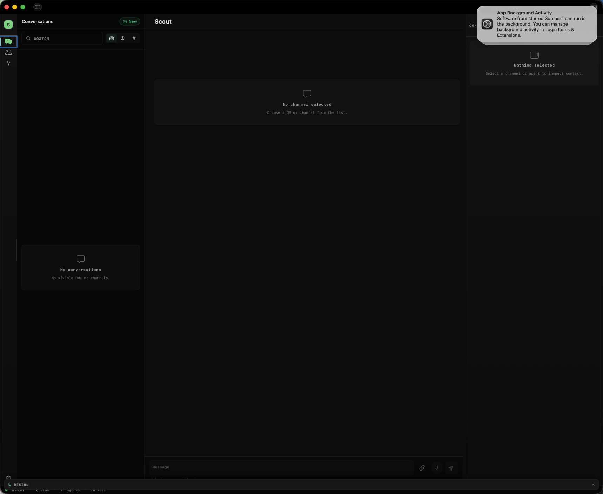

### Native Agents Grid

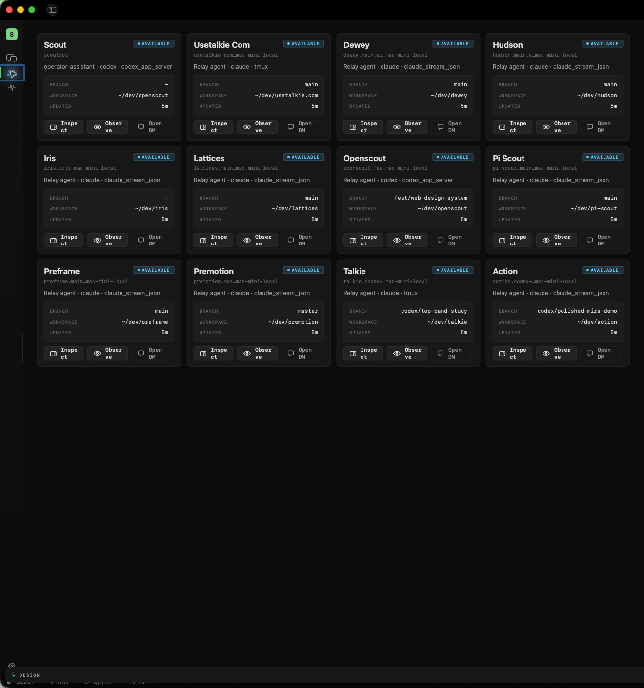

What worked:

- `scout menu status` confirmed the helper was installed and running.
- the full native app launched.
- the Agents tab surfaced live/discovered agents.
- the native app showed 12 agents and 95+ tail events.

QA notes:

- macOS showed an App Background Activity notification on first launch.
- The native app showed 12 agents while the web/CLI surfaces showed 19.
- The native desktop path did not present the same first-run onboarding ladder;
  it opened directly into the app once web/CLI state existed.
- On the Agents tab, the right context rail rendered a DM/channel finder while
  no agent was selected. That produced a small loading/empty-state flicker in a
  place that should stay quiet until there is meaningful context.

## First-Run Product Note

The highest-value first-run surface is not another empty app shell. It is a
reviewable inventory of what Scout already discovered and inferred:

- harnesses and runtimes
- projects and workspaces
- live transcript/log sources
- running harness processes and sessions
- per-project configuration, defaults, and useful integration clues

That inventory should start deterministic: crawl, organize, show evidence, and
let the operator edit, validate, or ignore the findings. A single dominant
agent backer can be offered after that to explain findings or propose fixes, but
setup should not depend on an agent interpretation step.

## Summary

The actual CLI and web paths can get to a healthy Scout state from clean
Scout-owned files on this machine. The desktop app launches and displays real
agent state once setup exists, but it is not yet equivalent as a zero-state
onboarding modality.

Highest-value follow-ups:

1. Fix the web onboarding `Create project` hang after the backend completes.
2. Align web project defaults with CLI intent: source root should probably be
   `~/dev`, and Codex should remain selected when requested.
3. Make `scout latest --messages` agree with the durable message/inbox path.
4. Reconcile desktop native agent counts with CLI/web agent counts.
5. Decide whether desktop should own a true first-run ladder or always delegate
   setup to the web flow.
