# OpenScout Install Recap

This is a visual play-by-play for onboarding from a fresh local machine. The
screenshots are deterministic recap frames based on the current install docs,
CLI README, macOS README, and web onboarding component states. They are not a
destructive recording of this workstation being reset.

All three modalities should converge on the same durable state:

- `~/Library/Application Support/OpenScout/settings.json`
- `~/Library/Application Support/OpenScout/relay-agents.json`
- `.openscout/project.json` in the active context
- a reachable local broker
- a working local web edge, usually `http://scout.local`
- at least one ready harness/runtime, such as Claude Code or Codex
- a first successful `send` or `ask`

## CLI Only

The CLI path should be fully usable without the web or desktop app. It collects
the same identity, source root, project, harness, service, and routing state.

### 1. Install The Public Command

```bash
bun add -g @openscout/scout
scout --help
```

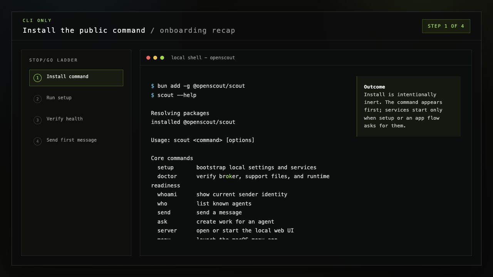

### 2. Bootstrap Shared Local State

```bash
scout config set name "Art"
scout setup --source-root ~/dev --default-harness codex
```

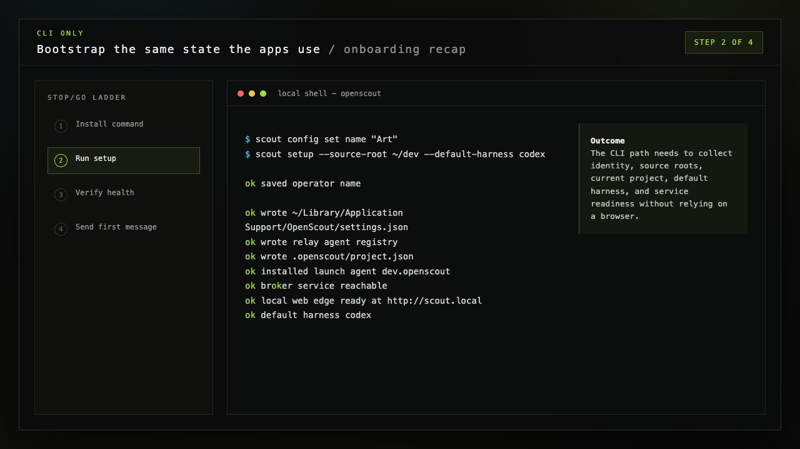

### 3. Verify Health And Identity

```bash
scout doctor
scout whoami
scout who
```

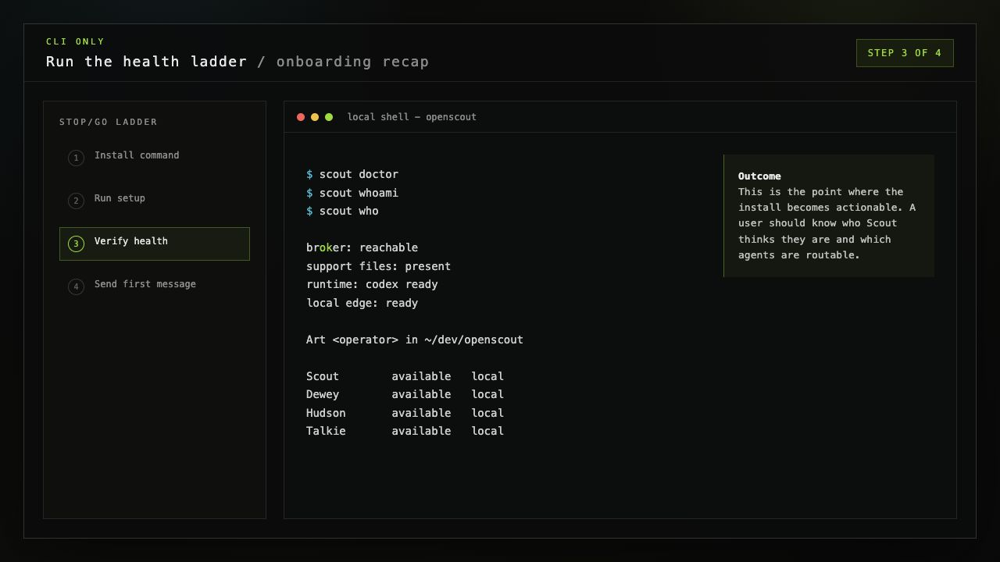

### 4. Send The First Useful Message

```bash
scout send --to dewey "hello from a fresh Scout install"
scout ask --to hudson "what should I catch up on?"
```

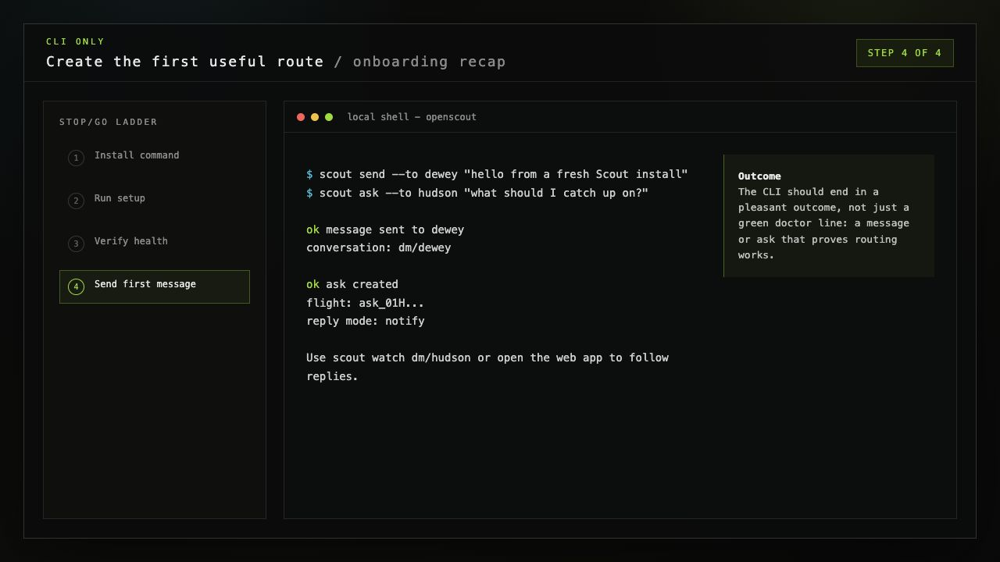

## Web App

The web app should make the same setup ladder feel direct and recoverable. It
should not require users to understand launch agents, ports, or local edge
details before they can reach a pleasant outcome.

### 1. Open The Local Web Surface

```bash
scout server open
```

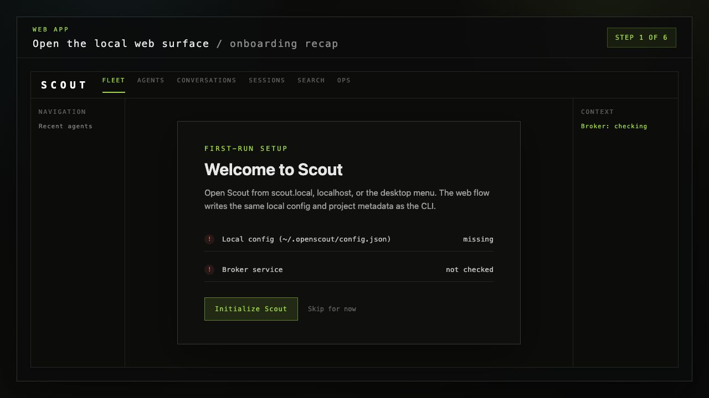

### 2. Create Local Config

The first web action writes the local config that lets the broker, web app, and
paired devices share known ports and paths.

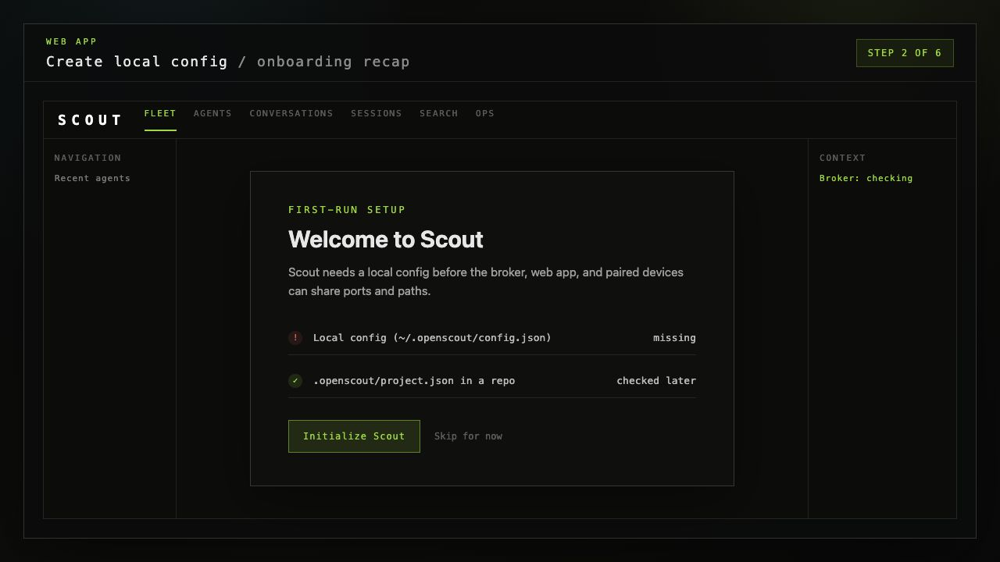

### 3. Set Operator Identity

The operator name should be obvious, editable, and reused by messages sent from
any surface.

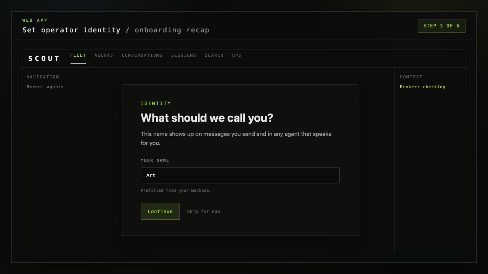

### 4. Choose Projects And Harness

Project setup should capture source roots, the current context root, and the
default harness without making the user leave the browser.

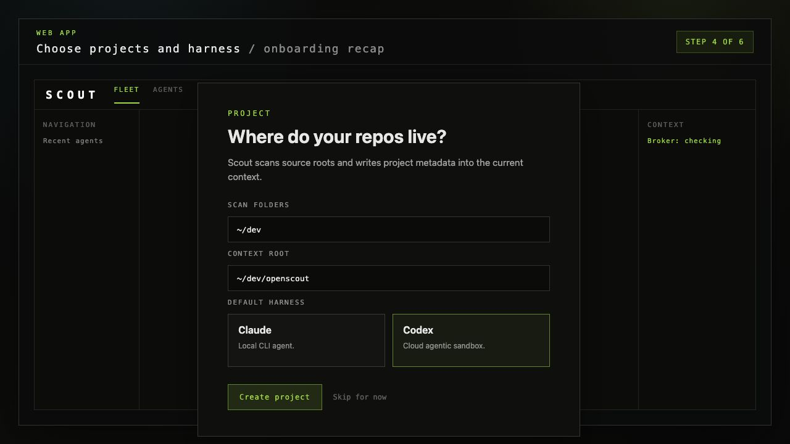

### 5. Finish Setup

The final onboarding step starts or repairs the broker, installs harness glue,
refreshes discovery, and checks runtime readiness.

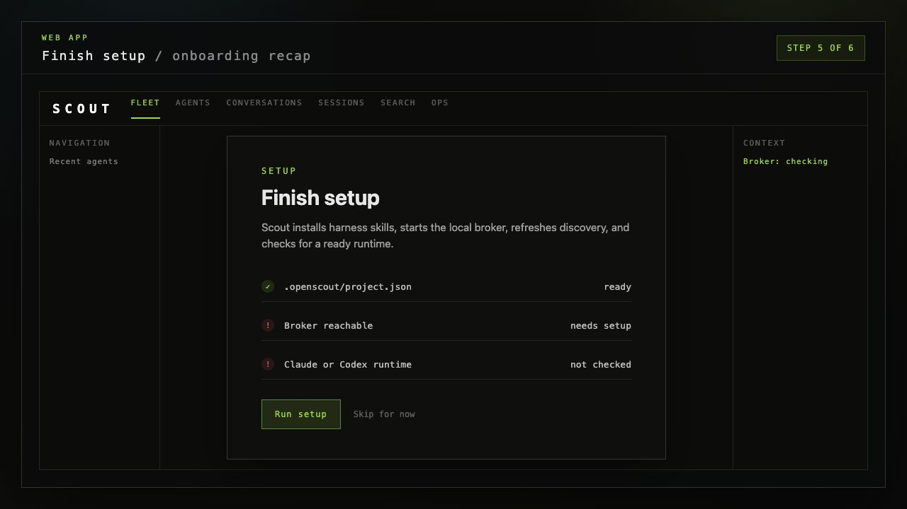

### 6. Land On A Useful Home Screen

After setup, the home screen should emphasize subscription context, agent
availability, activity when it exists, a plain catch-up input, and a compact
local tail preview.

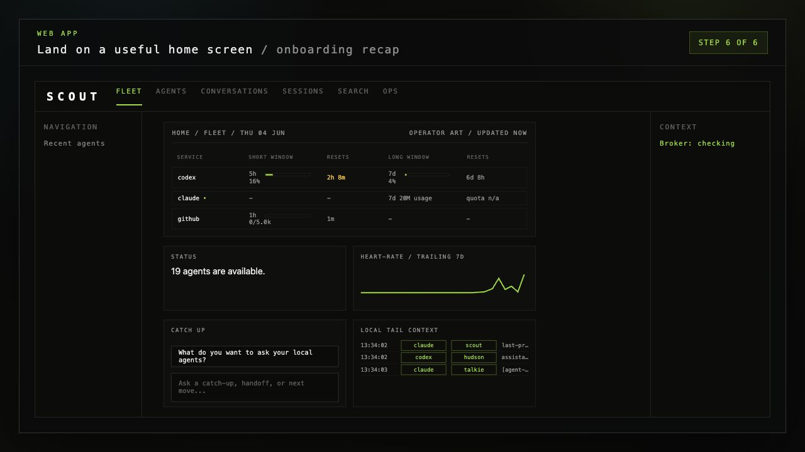

## Desktop App

The desktop app should be a friendly native entry point into the same Scout
state. It should not invent a different install model.

### 1. Install Or Launch OpenScout

```bash
scout menu
```

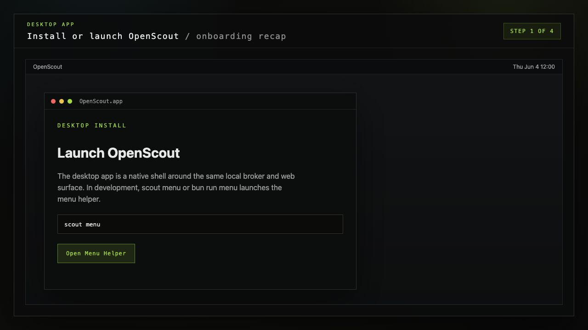

### 2. Start Scout From The Menu

The menu app should expose service state and an obvious setup/start action.

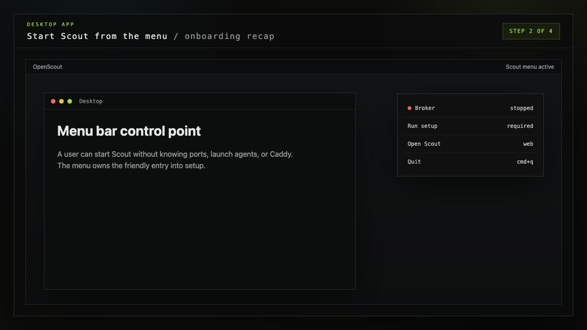

### 3. Run The Same Onboarding Ladder

Desktop onboarding should drive identity, source roots, default harness, broker
readiness, and runtime readiness through the same underlying APIs.

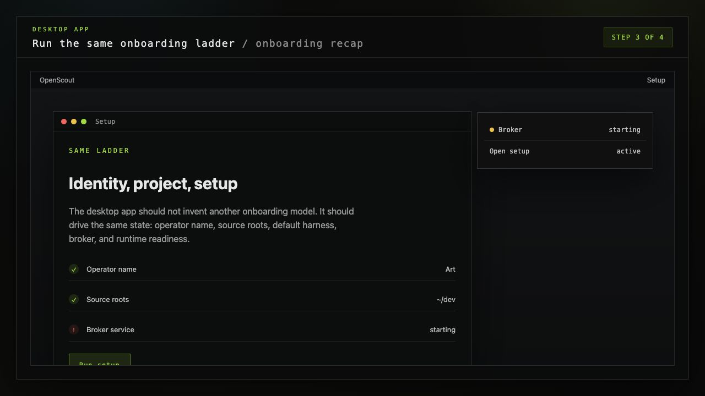

### 4. Keep A Healthy Daily Control Point

Once setup is healthy, the desktop surface should remain useful as a quick
status and repair point: broker state, web launch, restart, and quit.

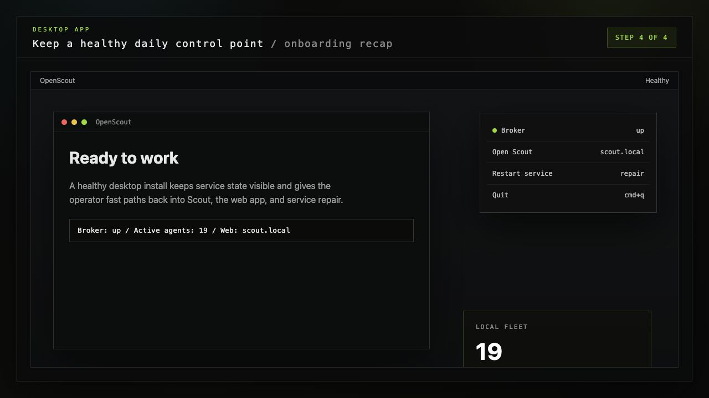

## Parity Checklist

| Capability | CLI | Web | Desktop |
| --- | --- | --- | --- |
| Install or launch entry | `bun add -g`, `scout --help` | `scout server open` or `scout.local` | `scout menu` or OpenScout.app |
| Operator identity | `scout config set name` | Identity step | Desktop setup step |
| Project roots | `scout setup --source-root` | Project step | Desktop setup step |
| Default harness | `--default-harness` | Harness picker | Desktop setup step |
| Broker/service setup | `scout setup`, `scout doctor` | Setup step | Menu setup/start |
| Web edge | printed by setup/doctor | same-origin app shell | Open Scout menu action |
| First useful outcome | `send` or `ask` | catch-up and tail context | menu opens app or setup |

The important product principle: the modality changes the shell, not the data
model. A user should be able to start in any one of the three and get back to
the same healthy Scout state.
