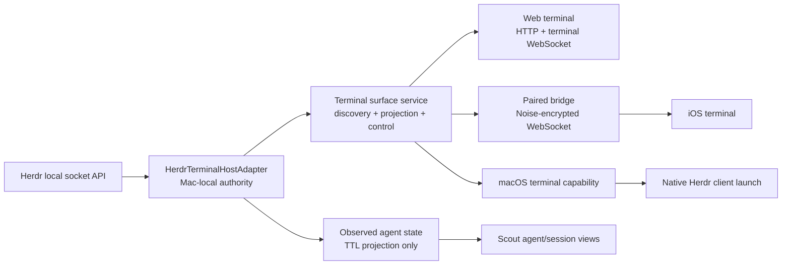

# First-Class Herdr Terminal Host Integration

Status: Proposed

Date: 2026-07-23

Scope: OpenScout web, iOS, macOS, shared protocol/runtime, and paired bridge

## Summary

OpenScout should integrate Herdr as a first-class **terminal host** and
**agent-state surface**. Herdr is not a Scout execution harness, and it should
not be modeled as a tmux-compatible process or added to `--harness`.

The complete integration has one shared host adapter on the Mac and three
platform presentations:

1. Web is the first complete client: discovery, ANSI-preserving Observe,
   semantic Takeover, agent state, controls, reconnect, and diagnostics.
2. iOS consumes the same capability over the authenticated paired bridge. It
   does not SSH into a tmux wrapper to reach Herdr.
3. macOS consumes the same inventory and per-pane control contract while
   retaining a native “open the full Herdr client” action.

The architectural rule is:

```text
harness session identity is durable
terminal surface identity is host-specific
terminal output remains external runtime material
Scout owns authorization and projection, not Herdr's session state
```

## Why This Is A Separate Transport

The current relay treats a terminal as a PTY byte stream. That is correct for a
fresh PTY, tmux attach, or Zellij attach. Herdr exposes a different and richer
contract through its local socket API:

- a bootstrap `session.snapshot`
- workspaces, tabs, panes, layouts, and agent records
- ANSI-preserving `pane.read` snapshots with revisions
- `pane.send_input`, `pane.send_text`, and `pane.send_keys`
- pane topology, layout, lifecycle, focus, and agent-state events
- native agent session references when the corresponding integration reports one

Pretending this API is a PTY would discard topology and agent state while
reintroducing fragile terminal emulation around snapshots. Conversely, changing
the tmux relay to behave like Herdr would risk established tmux and Zellij
behavior.

OpenScout therefore needs a discriminated terminal transport:

```ts
type TerminalTransportKind = "byte-stream" | "host-snapshot";

type TerminalSurfaceLocator =
  | {
      host: "tmux";
      sessionName: string;
      paneTarget?: string;
    }
  | {
      host: "zellij";
      sessionName: string;
      paneId?: string;
      socketDir?: string;
    }
  | {
      host: "herdr";
      hostSession: string;
      workspaceId: string;
      tabId: string;
      paneId: string;
    };
```

tmux and Zellij continue through `byte-stream`. Herdr uses `host-snapshot`.
The client selects rendering and input behavior from `transportKind`, not from
the host's name.

## Ownership And Data Boundaries

| Concern | Authority |
| --- | --- |
| Scout messages, invocations, flights, work items, bindings | Scout broker |
| Herdr workspace/tab/pane topology | Herdr |
| Herdr pane output and scrollback | Herdr |
| Herdr-reported agent lifecycle and native session reference | Herdr, observed by Scout |
| Observe/Takeover authorization | Scout server or paired bridge |
| UI projection, reconnect cursor, and client viewport | OpenScout client |

OpenScout may cache lightweight topology, revision, and status metadata. It must
not import pane output as Scout conversation messages or make the Scout database
the canonical Herdr transcript store.

OpenScout must not edit Herdr configuration during normal discovery or relay
operation. Installing or upgrading a Herdr integration is an explicit operator
action.

## Target Architecture



There is one Mac-local adapter. Web, iOS, and macOS do not each parse Herdr CLI
output or open arbitrary socket paths independently.

## Shared Protocol Model

### Terminal subjects and surfaces

The current `TerminalSessionRecord` sometimes uses a backend name as a
synthetic harness. Herdr makes that overloading untenable because a Herdr pane
can be either an identified harness session or an ordinary terminal pane.

Introduce an explicit subject:

```ts
type TerminalSubject =
  | {
      kind: "harness-session";
      harness: string;
      sourceSessionId: string;
    }
  | {
      kind: "host-pane";
      host: "tmux" | "zellij" | "herdr";
      hostSession: string;
      paneId: string | null;
    };

type TerminalSurface = {
  id: string;
  subject: TerminalSubject;
  transportKind: "byte-stream" | "host-snapshot";
  locator: TerminalSurfaceLocator;
  title: string;
  cwd: string | null;
  state: "live" | "detached" | "exited" | "unreachable";
  capabilities: TerminalSurfaceCapabilities;
  attachCommand: string[] | null;
  updatedAt: number;
};
```

When Herdr supplies `agent_session`, the adapter normalizes the agent name to a
Scout harness and correlates the pane with the durable harness session. When it
does not, the pane remains an honest `host-pane`; it must not become a fake
Herdr harness session.

Surface IDs are opaque and server-issued. A Herdr surface identity is derived
from the Scout node, Herdr host session, and public pane ID. URLs and clients
must not construct or split surface IDs using colon-delimited strings.

### Capabilities, not backend conditionals

```ts
type TerminalSurfaceCapabilities = {
  observe: boolean;
  takeover: boolean;
  ansiSnapshots: boolean;
  scrollback: boolean;
  semanticKeys: boolean;
  interrupt: boolean;
  eof: boolean;
  suspend: boolean;
  closePane: boolean;
  restartAgent: boolean;
  focusPane: boolean;
  resizeHostLayout: boolean;
};
```

Clients render only supported actions. They must not translate every existing
tmux control button into a Herdr command by analogy.

`scrollback` is true only when the negotiated Herdr schema exposes the
`pane.read` sources used by the adapter. The initial contract maps bounded
scrollback reads to `source: "recent"`; an explicitly unwrapped transcript view
may use `source: "recent_unwrapped"`. Observe continues to use the authoritative
`source: "visible"` grid.

### Adapter contract

Add a shared runtime boundary along these lines:

```ts
interface TerminalHostAdapter {
  readonly id: "tmux" | "zellij" | "herdr";
  probe(): Promise<TerminalHostProbe>;
  snapshot(): Promise<TerminalHostSnapshot>;
  open(locator: TerminalSurfaceLocator, mode: "observe" | "takeover"):
    Promise<TerminalSurfaceChannel>;
  control(locator: TerminalSurfaceLocator, action: TerminalControlAction):
    Promise<TerminalControlResult>;
}

interface TerminalSurfaceChannel {
  bootstrap(): Promise<TerminalProjection>;
  next(afterRevision: number, signal: AbortSignal): Promise<TerminalProjection | null>;
  send(input: TerminalSemanticInput): Promise<void>;
  close(): Promise<void>;
}
```

The Herdr adapter implementation belongs in the TypeScript runtime/server
layer, not in React or Swift. It owns:

- socket discovery and connection
- protocol/version negotiation
- JSON framing and response correlation
- snapshot normalization
- output-revision waiting and pane reads
- semantic input encoding
- reconnect and resnapshot
- mapping Herdr errors to stable Scout errors

### Version and feature negotiation

Do not rely only on `herdr --version`. On connect, inspect the server snapshot
and schema/protocol metadata, then require the feature set actually used:

- `session.snapshot`
- ANSI `pane.read` with revision
- public `events.wait` support for `pane_output_changed`, including `pane_id`
  and `min_revision`
- `pane.send_input` for Takeover
- agent records and native session references for agent-state correlation

The locally verified Herdr 0.7.3 installation exposes the required
revision-bearing wait through the public socket schema: `events.wait` accepts a
`pane_output_changed` matcher with `pane_id` and optional `min_revision`.
Tier-one Observe should keep one server-owned wait outstanding per observed
pane, then issue the next ANSI `pane.read` after the revision advances.
`pane.wait_for_output` is a separate content-matching API and is not the
primitive used to mirror a pane. Other Herdr versions must be accepted only
after the installed schema proves the same capabilities.

OpenScout must still negotiate this exact matcher from the installed schema
rather than infer it from a version string or from an internal event enum.

Installations without that capability may use activity-aware, bounded
`pane.read` revision polling as a clearly diagnosed compatibility mode. Polling
backs off when the revision is stable, speeds up briefly after activity or
input, and coalesces reads per pane. It is not the tier-one completion path.

Unsupported installations otherwise remain attach-only and show a specific
upgrade diagnostic. `scout doctor` should report installed CLI version,
reachable server version, socket path source, supported capabilities,
integration status, output-observation mode, and the minimum feature that is
missing.

The socket path is resolved locally from Herdr's supported discovery rules. A
web or mobile request may select an advertised host session but may never pass
an arbitrary filesystem socket path.

## Web: First Complete Client

### 1. Discovery and inventory

Extend the server terminal discovery service with the Herdr adapter:

1. Resolve reachable Herdr host sessions.
2. Call `session.snapshot` for each reachable session.
3. Normalize workspaces, tabs, panes, layouts, agent state, cwd, and native
   agent-session references.
4. Correlate identified agent panes with existing harness sessions.
5. Return unidentified panes as `host-pane` subjects.
6. Subscribe to topology and agent-state events and invalidate the normalized
   snapshot cache.

One Herdr socket represents one server/session, and `session.snapshot` takes no
session selector. Discovering multiple sessions therefore means discovering and
connecting to multiple supported socket endpoints, then calling
`session.snapshot` once on each connection.

The terminal library should group Herdr targets as:

```text
Herdr session
  Workspace
    Tab
      Pane — agent, status, cwd, title
```

The default list can emphasize agent panes while allowing “Show all panes.”
Herdr is a backend badge and grouping dimension, not the durable session noun.

Recommended server seams:

- `packages/runtime`: host adapter, socket client, protocol normalization
- `packages/protocol`: discriminated locators, subjects, capabilities, wire
  messages
- `packages/web/server/terminal-session-discovery.ts`: adapter registry rather
  than tmux/Zellij conditionals
- `packages/web/server/core/terminal-surfaces.ts`: protocol-owned descriptor
  rather than a separate `"tmux" | "zellij"` copy
- `/api/terminal-sessions`: normalized subjects and surfaces
- `/api/terminal-hosts/herdr/doctor`: read-only diagnostics

### 2. Observe

Observe opens a server-side Herdr surface channel in read-only mode.

Bootstrap:

1. Read pane metadata and its current terminal dimensions.
2. Request `pane.read` with `source: "visible"`, `format: "ansi"`, and
   `strip_ansi: false`; the Herdr defaults are text with ANSI stripped and are
   not safe for this projection.
3. Send a revisioned `terminal:snapshot` message.
4. Start a negotiated `events.wait` loop for `pane_output_changed` with
   `min_revision` set to that revision.
5. On change, read and send the next complete snapshot.

In compatibility mode only, step 4 is an activity-aware revision polling loop.
The rest of the projection contract is identical, so changing the host-side
wait mechanism later does not change any web, bridge, or native client.

Proposed wire message:

```ts
type TerminalSnapshotMessage = {
  type: "terminal:snapshot";
  surfaceId: string;
  generation: number;
  revision: number;
  cols: number;
  rows: number;
  format: "ansi";
  text: string;
  truncated: boolean;
};
```

Snapshots are replacements, not byte-tail append operations. The renderer must
apply each snapshot atomically using synchronized terminal updates, reset the
cursor and attributes at the snapshot boundary, and discard older generations
or revisions. This prevents mid-escape reconnects, stale underlines, partial
redraws, and visible clear/repaint flicker.

ANSI is preserved end to end. Scout must not strip styling or repaint all text
with a single foreground color. The app theme controls terminal background and
default colors only; explicit terminal ANSI colors remain authoritative.

Observe enforcement is server-side:

- reject input and mutating controls
- do not focus or resize the Herdr pane
- do not change Herdr client attachment state
- do not let an observer's browser viewport arbitrate host dimensions

The browser fits or letterboxes the authoritative host grid. A read-only viewer
must never resize the live pane merely because its sidebar opened.

### 3. Takeover

Takeover uses the same snapshot projection with input enabled. Input must be
semantic because Herdr accepts text and named key combinations rather than a
raw PTY byte stream.

```ts
type TerminalSemanticInput =
  | { kind: "text"; text: string }
  | {
      kind: "key";
      key: string;
      control?: boolean;
      alt?: boolean;
      shift?: boolean;
      meta?: boolean;
    }
  | { kind: "paste"; text: string };
```

The client terminal integration should distinguish printable/IME text, paste,
and key events. The server translates keys into Herdr's supported key-combo
grammar and calls `pane.send_input`. Raw escape sequences from xterm must not be
sent as printable text.

Takeover does not automatically focus the pane in another Herdr client or alter
its layout. Those are separate, capability-gated actions. Multiple Scout
Takeover clients may be allowed in the high-trust pilot posture, but their
presence must be visible. A later exclusive-control lease can be added without
changing the adapter contract.

### 4. Controls

Map controls explicitly:

| Scout action | Herdr operation |
| --- | --- |
| Interrupt | `pane.send_input` with `ctrl+c` |
| EOF / quit | `pane.send_input` with `ctrl+d` |
| Suspend job | `pane.send_input` with `ctrl+z` |
| Detach viewer | Close Scout channel only |
| Focus in Herdr | `agent.focus` or pane focus, explicit action |
| Close pane | `pane.close`, destructive confirmation required |
| Restart agent | Expose only when Herdr reports a supported native agent session and operation |

“Force quit bridge” remains a Scout relay operation. It must not close a Herdr
pane. tmux-specific restart/resume process inspection does not run against
Herdr.

### 5. Reconnect and failure behavior

Every channel has a `generation`. On Scout WebSocket reconnect:

1. Reauthorize the requested surface and mode.
2. Re-resolve the opaque surface ID to the Herdr locator.
3. Fetch a fresh snapshot and increment generation.
4. Resume change waits from the fresh revision.

Never replay a cached ANSI byte tail into a Herdr projection.

If a pane moves, re-resolve it from Herdr events. If it closes, return a typed
`surface_closed` state. If Herdr restarts and a pane ID changes, use the native
agent session reference to offer the replacement pane; do not silently attach a
different process.

### 6. Web UX

The existing terminal route and workspace canvas remain the primary web UI.
Add:

- Herdr workspace/tab grouping in the picker
- agent lifecycle and integration-source badges
- Observe as the safe default from inventory
- explicit Takeover transition
- read-only keyboard suppression in Observe
- capability-driven action menus
- host-grid and connection diagnostics in Context
- “Open in Herdr” when the browser is local to the Mac

Routes carry an opaque `surface` ID. They do not expose socket paths or require
the browser to know Herdr workspace/tab/pane syntax.

## iOS: Paired Remote Herdr Client

### Product shape

The existing iOS terminal remains useful as a general SSH/tmux shell. Herdr is
an additional terminal target, not a replacement for SSH:

```text
Terminal
  Herdr panes
  Scout SSH shell
```

Selecting a Herdr pane opens Observe by default, with an explicit Take Over
action. The current Hudson terminal renderer and hosted keyboard are reused,
but transport becomes a shared semantic terminal capability rather than being
hardwired to `TerminiSSHWorkspace`.

### Bridge protocol

The iPhone must not connect directly to a Unix socket or receive a socket path.
The paired Mac brokers the same `TerminalHostAdapter` over the authenticated,
Noise-encrypted bridge.

Add bridge methods/messages conceptually equivalent to:

```text
mobile/terminal/surfaces
mobile/terminal/surface/open
mobile/terminal/surface/input
mobile/terminal/surface/control
mobile/terminal/surface/ack
mobile/terminal/surface/close
terminal.surface.snapshot event
terminal.surface.state event
```

Opening returns a random stream ID plus the first snapshot. Subsequent snapshots
carry monotonically increasing generation and revision. The bridge enforces the
same Observe/Takeover policy as web and ignores client-supplied authority claims.

Use bounded per-stream buffering and acknowledgements. Coalesce pending Herdr
snapshots to the newest revision rather than queueing obsolete complete screens
over a slow cellular link.

### Shared native capability

Add transport-neutral types and protocols to `ScoutCapabilities`:

```swift
public protocol TerminalSurfaceProviding: Sendable {
    func listTerminalSurfaces() async throws -> [ScoutTerminalSurface]
    func openTerminalSurface(
        id: String,
        mode: ScoutTerminalControlMode
    ) async throws -> any ScoutTerminalSurfaceChannel
}
```

The shared native layer owns:

- surface and capability models
- snapshot generation/revision reducer
- reconnect state machine
- semantic input model
- stale-snapshot rejection
- connection and host-state diagnostics

iOS supplies the paired-bridge adapter. macOS supplies the local HTTP/WebSocket
adapter. Views remain platform-specific.

### Native rendering and input

HudsonTerminal needs a supported full-snapshot application path rather than
simulating a PTY append stream. It should atomically replace visible terminal
state while preserving ANSI styles and cursor state.

The hosted keyboard already distinguishes modifiers and text closely enough to
produce `TerminalSemanticInput`. Dictation remains text-only and never appends
Return automatically. Observe mode does not mount a writable keyboard.

### Lifecycle

- App background closes the bridge stream, not the Herdr pane.
- Foreground/reconnect opens a fresh generation and snapshot.
- Switching machines closes the previous stream before resolving the new node.
- A closed pane becomes a stable unavailable screen with an option to locate
  the same native agent session if Herdr restored it elsewhere.
- SSH credentials and Herdr control authority remain separate trust domains.

### Security

Herdr bridge methods require a trusted paired device on the encrypted bridge.
The Mac accepts only opaque surfaces it previously advertised to that device.
It does not expose arbitrary Herdr methods, arbitrary socket paths, filesystem
reads, or general command execution.

Observe and Takeover are separate server permissions. Destructive pane close or
agent restart actions require explicit confirmation and an auditable Scout
operator action record submitted through the broker, which remains the
canonical writer for Scout-owned records; the Herdr adapter never writes those
records directly.

## macOS: Unified Local Integration

### Replace duplicate discovery

The macOS app currently invokes `herdr session list --json` directly and merges
those results beside `/api/terminal-sessions`. That proves local attachment but
creates a second discovery model.

Move macOS to the shared terminal-surface inventory. The Mac app should not own
Herdr version parsing, session normalization, agent correlation, or socket
selection.

### Two intentional experiences

macOS should offer both:

1. **Herdr pane surface** — the same Observe/Takeover semantics and agent context
   available on web and iOS.
2. **Full Herdr client** — launch or attach the native Herdr TUI when the operator
   wants workspace layout, sidebars, plugins, or Herdr-native navigation.

These are labeled distinctly. A pane surface does not inject Herdr prefix
shortcuts. The full client may continue using Herdr-native keyboard controls.

### Native capability adapter

The macOS app adopts `TerminalSurfaceProviding` through local Scout HTTP and
terminal WebSocket endpoints. It may render host snapshots natively once
HudsonTerminal supports snapshot replacement. Until that shared renderer path
lands, the existing web terminal embed is the acceptable first macOS consumer;
duplicating the Herdr socket client in Swift is not.

### Diagnostics and setup

The Terminal settings page should show:

- CLI and server reachability
- negotiated Herdr protocol capabilities
- discovered host sessions
- installed agent integrations and versions
- whether native agent session identity and lifecycle authority are available
- an explicit “Open Herdr setup” or “Install integration” action

Normal app launch performs no Herdr config mutation. Setup actions clearly show
the command and affected host configuration before running it.

## Agent-State Projection

Herdr agent state enriches Scout reachability; it does not replace Scout work
lifecycle.

Normalize Herdr semantic state into an observed projection:

```ts
type ObservedAgentSurfaceState = {
  source: "herdr";
  nodeId: string;
  surfaceId: string;
  harness: string | null;
  sourceSessionId: string | null;
  state: "idle" | "working" | "blocked" | "done" | "unknown";
  title: string | null;
  observedAt: number;
  expiresAt: number;
};
```

Rules:

- Herdr state may update an endpoint's observed presence/status.
- Herdr `done` is display-only observed state. It never completes a Scout work
  item, invocation, or flight and may collapse to `unknown` after its TTL.
- It never completes or fails a Scout flight by itself.
- A native agent session reference may correlate the surface to a Scout session.
- Missing or expired reports become `unknown`; they are not proof of completion.
- Herdr presentation labels are display metadata, not new Scout identities.

## Implementation Order

### Phase 0 — compatibility fixture

- Verify the development Herdr installation exposes the socket schema
  (`herdr api schema`), revisioned ANSI reads, and the public
  `events.wait`/`pane_output_changed` matcher with `min_revision`.
- Treat those generated-schema capabilities as the compatibility boundary; do
  not infer support from internal event enums or version strings.
- Capture a sanitized schema and representative snapshots/events as test
  fixtures.
- Verify ANSI reads, output revisions, semantic keys, reconnect, agent session
  references, and server restart behavior against a real Herdr session.
- Record the tested protocol range; do not vendor Herdr source.

### Phase 1 — shared model and Herdr adapter

- Add discriminated subject, locator, transport, capability, snapshot, and
  semantic-input types to `packages/protocol`.
- Add the terminal host adapter boundary and Herdr socket client to the runtime.
- Add version negotiation, doctor output, fixtures, and contract tests.
- Keep the existing tmux/Zellij byte-stream implementations behaviorally
  unchanged behind adapters.

### Phase 2 — web discovery and Observe

- Add Herdr topology discovery and event-driven cache invalidation.
- Add Herdr surfaces to `/api/terminal-sessions` and the web picker.
- Add `terminal:snapshot` to the relay protocol and atomic ANSI replacement to
  the terminal renderer.
- Ship read-only Observe first and measure repaint stability, color fidelity,
  CPU, memory, and socket load.

### Phase 3 — web Takeover and controls

- Add semantic key/text/paste input.
- Add server-side Observe rejection and capability-driven actions.
- Add reconnect generations, coalescing, close/error states, and multi-client
  presence.
- Remove Herdr assumptions from tmux-specific controls and copy.

### Phase 4 — shared native capability and iOS

- Add terminal-surface protocols and reducers to `ScoutCapabilities`.
- Add trusted paired-bridge inventory, streaming, input, ACK, and close methods.
- Add the Herdr picker and Observe/Takeover UX to iOS.
- Validate on LAN, tailnet, and relay-only cellular paths.

### Phase 5 — macOS convergence

- Replace direct CLI discovery with the shared inventory.
- Adopt per-pane Observe/Takeover through the shared native capability.
- Retain the explicit full Herdr client launcher.
- Move setup and integration health into shared doctor output.

## Test And Acceptance Matrix

### Shared/runtime

- Snapshot/schema fixtures decode across the supported Herdr protocol range.
- Unknown fields are tolerated; missing required capabilities are diagnosed.
- Tier-one mode blocks on the public revision-bearing `events.wait` output
  matcher; compatibility polling is labeled and covered by load/backoff tests.
- Socket disconnect cancels waits and releases every local resource.
- Reconnect always creates a fresh generation and full snapshot.
- Native agent session references correlate without inventing harness sessions.
- Pane output is absent from Scout message and conversation storage.

### Web

- A running Herdr pane appears without a manual app restart.
- Observe shows ANSI colors, attributes, cursor position, and Unicode correctly.
- Repeated full snapshots do not visibly clear/flicker.
- Reconnect never begins in the middle of an escape sequence.
- Observe input is rejected at the server even if a client forges messages.
- Takeover handles text, paste, arrows, modifiers, function keys, interrupt, EOF,
  and suspend.
- Two observers do not resize or otherwise mutate the Herdr pane.
- Slow clients receive the latest screen rather than a backlog of stale screens.
- Existing PTY, tmux, and Zellij relay tests and visual behavior remain unchanged.

### iOS

- A trusted phone lists the same Herdr surfaces as web for the selected Mac.
- Observe and Takeover work over LAN, tailnet, and relay-only paths.
- Background/foreground and network changes do not terminate the Herdr pane.
- Hosted keyboard and dictation use semantic input; Observe is non-writable.
- Untrusted or unpaired clients cannot list, open, or control Herdr surfaces.
- Switching machines cannot leak a previous machine's pane or stream.

### macOS

- Native inventory matches web because both consume the same adapter snapshot.
- Per-pane Observe/Takeover preserves ANSI styling.
- Full Herdr client launch still works for default and named sessions.
- No Herdr CLI parsing remains in the Swift UI.
- Missing/outdated Herdr produces actionable doctor output, not an empty list.

## Non-Goals

- Herdr is not added as a Scout execution harness.
- Scout does not reimplement Herdr's workspace or layout UI.
- Scout does not store Herdr scrollback as broker messages.
- Scout does not silently install Herdr hooks or modify Herdr configuration.
- The first release does not expose arbitrary Herdr socket methods to browsers
  or paired devices.
- The Herdr work does not rewrite or destabilize the tmux/Zellij byte relay.

## Completion Definition

Herdr is fully first-class when all three clients discover the same Herdr
surfaces through the shared adapter; Observe is server-enforced and visually
faithful; Takeover uses semantic input; agent state and native session identity
are correlated without changing Scout ownership; reconnect is snapshot-safe;
and macOS retains a deliberate path into the full Herdr client.

Anything less should be described precisely as catalog support, native-client
launch support, or platform-specific preview support rather than “complete
Herdr integration.”

## References

- [Herdr socket API](https://herdr.dev/docs/socket-api/)
- [Herdr integrations](https://herdr.dev/docs/integrations/)
- [`docs/specs/terminal-session-intake-surfaces.md`](../specs/terminal-session-intake-surfaces.md)
- [`docs/eng/sco-031-native-terminal-surfaces.md`](../eng/sco-031-native-terminal-surfaces.md)
- [`docs/eng/sco-061-native-app-shared-architecture-ios-macos-hudson.md`](../eng/sco-061-native-app-shared-architecture-ios-macos-hudson.md)
- [`docs/eng/sco-071-terminal-over-relay-tunnel.md`](../eng/sco-071-terminal-over-relay-tunnel.md)
- [`docs/agent-integration-contract.md`](../agent-integration-contract.md)
