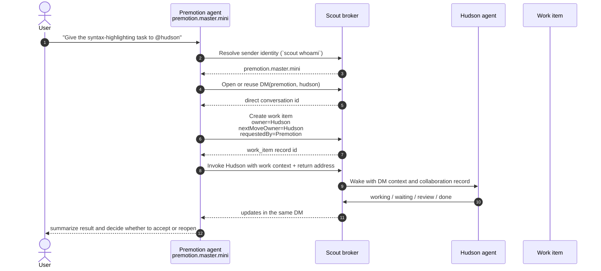

# Scout Agent Delegation

This document captures the intended workflow for one-to-one agent delegation in Scout, using the Premotion -> Hudson syntax-highlighting handoff as the motivating example.

## Core Rule

When one project agent asks one other agent to do concrete work, the default should be:

1. The sender is the acting project agent, not the human operator
2. The route is a DM, not `channel.shared`
3. The work has an owner and a next move owner
4. Progress, review, and completion stay attached to that same private thread

The collaboration can succeed even when these semantics are wrong, but the logs, UI, and future automation will learn the wrong story.

## Ideal Flow



## What Was Wrong In The Historical Flow

The observed exchange got real work done, but it taught the wrong semantics:

- the collaboration looked like a shared/public message even though the target was a single agent
- the visible sender did not reliably preserve the acting project agent
- the handoff behaved like an untyped consult instead of a tracked work collaboration

That mismatch matters because future prompts, sweeps, notifications, and analytics will key off the recorded semantics, not just the fact that the target eventually replied.

## Current Best-Available CLI Pattern

Today, the best available Scout CLI pattern for a one-to-one work handoff is:

```bash
scout whoami
scout ask --to hudson "Build the editable CodeViewer and report back with the integration-ready surface."
```

If the invoking shell, app host, or relay path might not preserve the acting project agent automatically, make the sender explicit:

```bash
scout ask --as premotion.master.mini --to hudson "Build the editable CodeViewer and report back with the integration-ready surface."
```

This is still a `consult` invocation under the hood. The next CLI surface should make the durable work-item path first-class so the start -> working -> review -> done lifecycle is not implicit.

## Product Direction

The first-class workflow for this category should be:

- `question` when the caller only needs an answer
- `work_item` when the caller is assigning owned execution

For the Premotion -> Hudson case, the correct semantic primitive is a `work_item`, not a broadcast and not an untyped shared-thread message.

## Regression Scenario

Use this scenario to guard the behavior:

1. Start from a project shell whose `.openscout/project.json` resolves to `premotion.master.mini`
2. Delegate one concrete task to `@hudson`
3. Assert the resulting conversation id is a DM id, not `channel.shared`
4. Assert the posted message metadata records `relayChannel = "dm"`
5. Assert the posted audience reason is `direct_message`
6. Assert the invocation requester is `premotion.master.mini`
7. If using the future durable surface, assert the collaboration record is a `work_item` with `ownerId = hudson...`, `nextMoveOwnerId = hudson...`, and `requestedById = premotion.master.mini`

This scenario is intentionally narrow. If it regresses, Scout will still appear to work, but it will quietly retrain agents and operators toward the wrong collaboration model.
