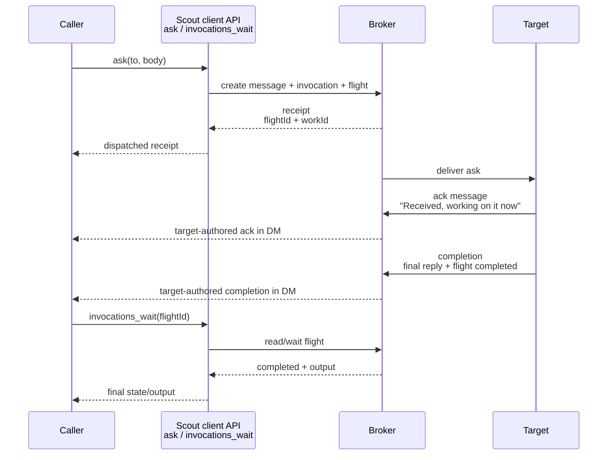
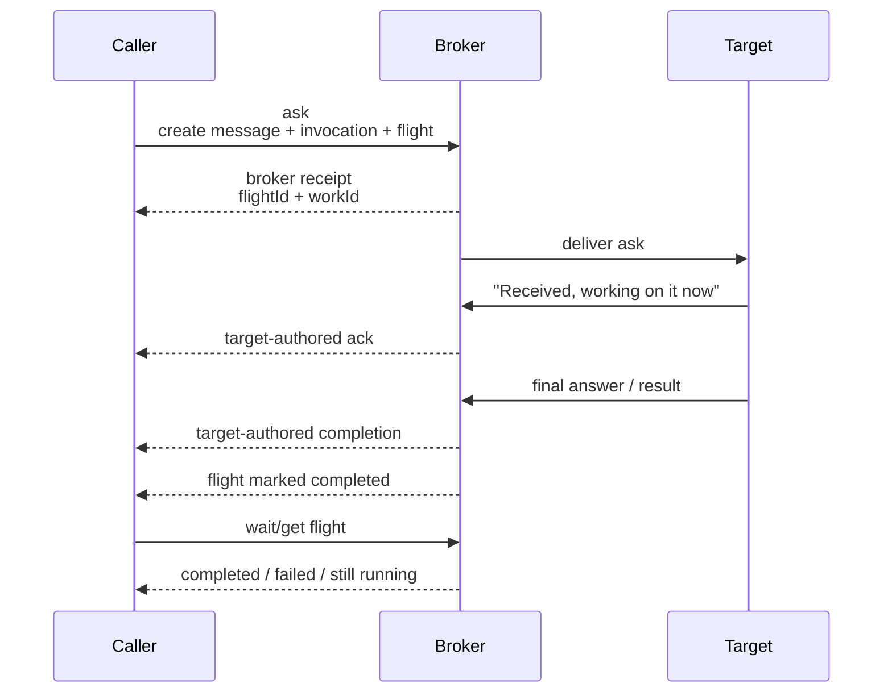

# Scout Comms

This is the front door for building a Scout-aware client, plugin, or adapter.
Read this when you want to understand how Scout interactions work: what gets
routed, what gets stored, how replies find their way home, and which pieces are
display affordances rather than protocol authority.

Scout comms are **not an HTTP spec**, but they are not not like one:

- an interaction has an intent, like a method
- it has routing context, like headers
- it has a body, which remains payload
- it returns durable ids and state, like a receipt/status surface
- it may create follow-on records such as flights, questions, or work items

The important difference is that the local broker, not a wire format, is the
canonical writer for Scout-owned coordination state. Product surfaces should
treat a **Chat** as the user-facing place where messages live; the broker and
protocol currently store that place as a **Conversation** with a
`conversationId`. For the Chat invariants and migration rules, read
[`chat-model.md`](./chat-model.md).

## Current Posture

OpenScout is for high-trust local developer pilots. Treat these docs as current
integration guidance, not a frozen public API guarantee. Do not build claims
around enterprise readiness, compliance readiness, hardened multi-tenancy, or
exactly-once distributed delivery.

## Mental Model

Scout has three layers:

| Layer | What It Does |
| --- | --- |
| Protocol | Shared TypeScript shapes for messages, invocations, conversations, delivery, reply context, and collaboration records |
| Broker | Local source of truth that resolves targets, writes records, plans delivery, and tracks asks |
| Surface | CLI, desktop, web, mobile, harness plugin, or external client that reads/writes through the broker |

A client should submit structured intent to the broker and render broker-owned
records back to the user. It should not infer routing from message body text.

## Core Records

| Record | Meaning | Primary Type |
| --- | --- | --- |
| Chat / Conversation | A durable place messages belong: DM, channel, group DM, thread, or system lane. Chat is the public product noun; Conversation is the internal broker/protocol record. | `ConversationDefinition` |
| Message | A durable body posted by one actor into one conversation | `MessageRecord` |
| Delivery | A planned transport-specific fan-out for a message or ask | `DeliveryIntent` / `ScoutDeliverRequest` |
| Invocation | An explicit request for an agent to do something | `InvocationRequest` |
| Flight | The lifecycle of an invocation: queued, running, waiting, completed, failed, or cancelled | `FlightRecord` |
| Reply context | The active return path when a harness is answering an inbound broker ask | `ScoutReplyContext` |
| Question | Lightweight information-seeking collaboration record | `QuestionRecord` |
| Work item | Durable owned execution record with progress, waiting, review, and done states | `WorkItemRecord` |
| Binding | Link between a Scout conversation and an external channel/thread | `ConversationBinding` |
| Dispatch record | Routing diagnostic for ambiguous, unknown, unparseable, or unavailable targets | `ScoutDispatchRecord` |

Protocol source files live in `packages/protocol/src`.

## Runtime Sessions

Scout is also a harness runtime surface. A Scout **agent** is a stable
addressable identity; a **session** is a concrete Claude, Codex, or future
harness conversation/process/thread; an **endpoint** attaches an agent identity
to one reachable session.

Cards are identity and return-address records. They do not by themselves mean a
harness session is alive. Treat card creation, registration, and explicit
session attachment as a pro integration layer for hosts or Scout-native agents
that intentionally manage identity infrastructure. Core agents should use
`ask`, `send`, and `reply`; the broker can create or bind cards internally when
needed. Commands that start or attach harnesses should use the public noun
**session** and should fail loudly when a requested harness cannot be backed by
a compatible session.

Examples of the intended shape:

```bash
scout session start --agent hudson --harness codex
scout session attach --agent hudson --harness codex --session <id>
scout session inspect --agent hudson --harness codex
```

`scout up` may remain as a convenience alias, but it should resolve to an
explicit session operation and report what happened. See
[`runtime-sessions.md`](./runtime-sessions.md).

## Interaction Workflows

### Message / Update

Use the message path for status, updates, notes, and channel posts. Even when no
owned work lifecycle is required, clients should expect a durable broker
receipt.

Examples:

```bash
scout send --to hudson "The branch is ready for review."
```

MCP equivalent:

```ts
messages_send({
  targetLabel: "@hudson",
  body: "The branch is ready for review."
})
```

Expected client behavior:

- send an explicit target field, not only `@hudson` in the body
- render the returned `conversationId`, `messageId`, and optional `flightId`
  when useful
- treat one explicit target as a DM
- let the broker decide whether a targeted DM needs a wake/start/attach turn;
  callers should not need to choose wake mechanics for normal sends
- require an explicit channel for group coordination
- do not treat message delivery as fire-and-forget; keep the receipt available

Quiet delivery should be an optional message/reply modifier, not a separate
primitive. It should still write the durable conversation record while
suppressing notify/wake side effects where target policy allows. `ask` should
not grow a quiet variant because it creates ownership and lifecycle state.

### Ask / Requested Reply

Use the ask path when the caller expects work, investigation, review, or an
answer.

Examples:

```bash
scout ask --to hudson "Review the auth module and report risks."
scout ask --project ../talkie "Review the auth module and report risks."
scout ask --project ../talkie --harness claude "Review the auth module and report risks."
```

MCP equivalent:

```ts
ask({
  to: "@hudson",
  body: "Review the auth module and report risks.",
})

ask({
  projectPath: "../talkie",
  harness: "claude",
  body: "Review the auth module and report risks.",
})
```

Expected client behavior:

- create or display a durable message for the ask
- use `projectPath` / `--project` when the project is known but the concrete
  agent or session is not; add `harness` / `--harness` when the capability
  matters. Scout resolves or creates the right project worker.
- do not teach agents to guess generic names such as `claude.main`; start from
  project + capability, then trust the broker receipt
- surface returned ids such as `flightId` and `workId`, plus any `ref`,
  `sessionId`, or broker-suggested friendly handle for follow-up
- treat the initial `ask` response as the broker receipt, not as the target
  agent's acknowledgement
- expect the target agent to promptly post a broker-visible acknowledgement in
  the same conversation when it starts working
- expect target-authored completion as a later message and flight completion
- use `invocations_wait` / `invocations_get` for longer follow-up polling
- show wake/session failures as lifecycle state, not as silent background limbo

Client API shape:



Product architecture shape:



### Broker Reply Mode

When a harness is invoked by Scout, it may receive an active reply context. In
that mode, the final answer should go back through the original broker
conversation instead of creating a new send.

The reply context looks like:

```ts
interface ScoutReplyContext {
  mode: "broker_reply";
  fromAgentId: string;
  toAgentId: string;
  conversationId: string;
  messageId: string;
  replyToMessageId: string;
  replyPath: "final_response" | "mcp_reply";
  action?: "consult" | "execute" | "summarize" | "status" | "wake";
}
```

Rules:

- first publish a short broker-visible acknowledgement in the same conversation
  when starting work
- if `replyPath` is `final_response`, the harness final assistant message is
  the broker-visible reply
- if `replyPath` is `mcp_reply`, use the provided reply tool for the initial
  acknowledgement and the final answer
- do not use `messages_send` or `ask` for the final answer to the original
  request
- `messages_reply` is a normal threaded message in the existing reply context;
  it should not create a fresh ask or owned work lifecycle
- quiet delivery is an optional message modifier/policy, not a distinct reply
  mode
- use Scout tools only to ask or delegate while solving the request

### Durable Work

If the interaction needs ownership, progress, waiting, review, or done states,
represent that as a work item rather than stretching a simple ask.

Use work updates for material transitions:

```ts
work_update({
  work: {
    workId: "work-...",
    state: "working",
    progress: {
      percent: 40,
      summary: "Runtime path mapped; tests pending."
    }
  }
})
```

Questions answer information. Work items carry ownership.

## Routing Rules

- One explicit target means DM.
- The default target should be the base agent or project identity. Harness,
  model, profile, node, and session details are instance constraints, not a
  different base agent, unless the caller explicitly asks for a specialized
  profile.
- If no concrete agent/session is known, route work by project path instead of
  running discovery just to invent a target.
- Group coordination requires an explicit channel.
- Shared broadcast is opt-in.
- Message body text is payload, not routing metadata.
- Prefer explicit routing fields over body mentions.
- Preserve follow-ups in the same conversation, thread, question, or work item.
- If a target is ambiguous, fail closed or ask one concise clarification.
- If sender identity is missing, establish a stable sender binding before
  routing.
- The broker should coach the sender with candidates, likely intent, and
  remediation commands instead of returning bare "not found" or "unavailable"
  errors when it has enough context to guide the next step.

Do not rely on body mentions for routing:

```ts
// Avoid: target is only text payload.
messages_send({ body: "@hudson can you check this?" })

// Prefer: target is explicit, body stays payload.
messages_send({
  targetLabel: "@hudson",
  body: "Can you check this?"
})
```

## Composer Route Operator

Human-facing composers can use `>>` as a route operator when `@` would collide
with host autocomplete or mention systems. The operator is input sugar for
explicit routing fields; clients should strip it from the body before handing
the request to the broker.

Typed:

```plaintext
/scout:ask >> hudson Review the parser.
/scout:ask >> ref:8kj4pd Continue from that result.
/scout:ask >> project:../talkie Compare auth.
/scout:send >> channel:ops Status is green.
```

Broker-facing shape:

```ts
ask({
  to: "hudson",
  body: "Review the parser."
})
```

The route target grammar is:

| Input | Structured Target |
| --- | --- |
| `>> hudson` | `{ kind: "agent_label", label: "hudson" }` |
| `>> agent:hudson` | `{ kind: "agent_label", label: "hudson" }` |
| `>> ref:8kj4pd` | `{ kind: "binding_ref", ref: "8kj4pd" }` |
| `>> project:../talkie` | `{ kind: "project_path", projectPath: "../talkie" }` |
| `>> id:agent-...` | `{ kind: "agent_id", agentId: "agent-..." }` |
| `>> channel:ops` | `{ kind: "channel", channel: "ops" }` |
| `>> broadcast` | `{ kind: "broadcast" }` |

The shared parser can recognize direct agent ids for clients that pass
`targetAgentId`. CLI composer routing currently uses labels, refs, and project
paths for asks; `channel:<name>` and `broadcast` are send/update routes.

`@agent` remains valid compatibility syntax where a surface owns the text box.
For new Scout-aware composers, prefer `>>` for target entry and render the
resolved target with the Scout contact mark, such as `⌖ hudson`.

If routing cannot complete safely, a client should render the broker's dispatch
or remediation result rather than guessing. `ScoutDispatchRecord` covers
`ambiguous`, `unknown`, `unparseable`, and `unavailable` targets, including
candidates or wake/register/retry guidance when available.

Good failure shape:

```plaintext
@hudson#codex resolved to codex-hudai.main.air-local, but no compatible Codex
session is attached. I found a Claude session for the same project.
Try: scout session start --agent codex-hudai --harness codex
```

Bad failure shape:

```plaintext
error: no explicit destination
```

## Receipts And Delivery State

A delivery receipt means the broker accepted the request and wrote or planned
broker-owned records. It does not mean the target read the message, completed
the task, or accepted the result.

Delivery state is layered:

| State | Meaning |
| --- | --- |
| `accepted` | local broker journaled the envelope and may still need to forward |
| `queued` | target is known, but dispatch or compatible endpoint readiness is pending |
| `waking` | Scout is starting or resuming a compatible harness session |
| `peer_acked` | remote broker journaled the envelope |
| `running` | target agent claimed the flight or work |
| `waiting` | target agent or broker is blocked on a named dependency |
| `completed` | terminal success for that delivery/flight layer |
| `deferred` | retry window is still open |
| `failed` | terminal failure with failure metadata |
| `cancelled` | cancelled before completion |

`peer_acked` is especially easy to overread. It means the remote broker has the
envelope, not that the remote agent has finished the work. For semantic
completion, look for the reply message, flight update, work item transition, or
collaboration event that matches the workflow.

For local harness-backed agents, a receipt may be followed by session wake or
attachment. Agent-card targets are fresh-session requests; historical session
records and superseded endpoint records are not candidates for ordinary card
routing. If the caller names `session:<id>`/`targetSessionId`, Scout should
continue that exact session or return a dispatch/lifecycle failure that says
"session reference not attachable" or "session not currently reachable".

The normal fresh-start workflow is therefore: capability request by
`projectPath` + optional `harness`; broker dispatch to an existing or new
compatible worker; receipt with durable ids/ref and, when available, a friendly
mnemonic handle; follow-up by that handle/ref; optional pin/name after the worker
proves useful.

## Coordination Cost

Scout should make coordination cost visible to developers and maintainers,
especially protocol overhead: the tokens Scout consumes or generates to route,
wrap, diagnose, summarize, attach, wake, or coach around a task. This should be
internal telemetry first, not a user-facing scoreboard. Keep it separate from
harness execution usage: the tokens Claude, Codex, or another model spends doing
the delegated work.

Where harnesses expose usage, broker records should preserve prompt, completion,
and total token counts linked to the relevant session, endpoint, message,
invocation, flight, or work item. Each record should label the source as
`protocol_overhead`, `harness_execution`, or another explicit category. Where
exact usage is unavailable, Scout may store estimates labeled as estimates.

Cost accounting should include the broker's own diagnostic/coaching work when it
spends extra reasoning to avoid sender-side retry loops. This lets Scout compare
one smarter broker response against repeated `who`, `latest`, `ps`, and failed
handoff attempts across many agents.

Track the value mix, not only the total. Low-value protocol tokens include
repeated "who am I," "who is up," "how do I create a card," and other boilerplate
orientation. High-value protocol tokens include useful onboarding, feature
guidance, concise recovery coaching, and context that lets the next agent do
better work.

Do not turn this into transcript warehousing. Store usage metadata, references,
source categories, and compact summaries, not full harness-owned conversations.

## Scout Contact Line

Some surfaces need a tiny first-line cue for inbound Scout-mediated work. The
contact line is generated from structured records; it is not the protocol.

Default grammar:

```plaintext
⌖ <source-short> <operator> <intent>:<ref>
```

Examples:

```plaintext
⌖ art ≔ ask:8kj4pd
⌖ art ↦ task:8kj4pd
⌖ art ≈ summary:8kj4pd
⌖ art ⟲ status:8kj4pd
⌖ art · wake:8kj4pd
```

Meanings:

| Operator | Intent | Meaning |
| --- | --- | --- |
| `≔` | `ask` | inbound ask; reply expected |
| `↦` | `task` | delegated or assigned work |
| `≈` | `summary` | summarize or synthesize |
| `⟲` | `status` | status check or check-in |
| `·` | `wake` | wake, nudge, or attention ping |

`⌖` means Scout-mediated contact. The short reference should usually be the
last useful suffix of the broker `messageId`, with full ids available in a
debug or collapsed context view. Do not parse the contact line for routing; use
the structured context fields.

When the contact cue is rendered next to payload text, use ` › ` as the
payload lead-in so previews and single-line host surfaces keep the boundary:

```plaintext
⌖ art ≔ ask:8kj4pd › I am writing a Hermes...
```

ASCII fallback:

```plaintext
scout art ask:8kj4pd
```

Screen-reader labels should expose the plain meaning, such as "Scout ask from
art, reference 8kj4pd."

## Client Checklist

When building a Scout client or plugin:

- read from broker-owned records rather than external harness transcripts
- send target, channel, reply, and work ids as explicit fields
- keep message body as payload
- preserve `conversationId`, `messageId`, `replyToMessageId`, and `flightId`
  across replies and status views
- distinguish message receipts from invocation/work lifecycles
- show waiting, failed, cancelled, no-recent-signal, superseded-registration,
  and session-reachability states explicitly
- distinguish broker acceptance, peer acknowledgement, agent completion, and
  requester acceptance
- expose session ids and harness mismatch diagnostics when runtime wake fails
- render dispatch/remediation results when targets are ambiguous, unknown, or
  unavailable
- prefer broker-authored guidance over forcing agents to rediscover routing
  state with manual `who` / `latest` loops
- keep full ids available for debugging even when the visible UI uses short refs
- do not promise exactly-once delivery, consensus, or complete transcript
  replication

## Where To Look In Code

| Need | Path |
| --- | --- |
| Conversation types | `packages/protocol/src/conversations.ts` |
| Message types | `packages/protocol/src/messages.ts` |
| Invocation and flight types | `packages/protocol/src/invocations.ts` |
| Delivery request and receipt types | `packages/protocol/src/scout-delivery.ts` |
| Dispatch and routing target types | `packages/protocol/src/scout-dispatch.ts` |
| Reply context type | `packages/protocol/src/scout-reply-context.ts` |
| Composer route parser | `packages/protocol/src/scout-composer.ts` |
| Runtime broker implementation | `packages/runtime/src/scout-broker.ts` |
| Local-agent prompt projection | `packages/runtime/src/local-agents.ts` |

## Related Docs

- `docs/architecture.md`
- `docs/agent-identity.md`
- `docs/runtime-sessions.md`
- `docs/collaboration-workflows-v1.md`
- `docs/agent-integration-contract.md`
- `docs/data-ownership.md`
- `docs/eng/sco-014-broker-owned-routing-and-context.md`
- `docs/eng/sco-017-scout-broker-reply-context.md`
- `docs/eng/sco-019-lightweight-mission-channels.md`
- `docs/eng/sco-026-scout-comms-grammar-and-semantic-hints.md`
