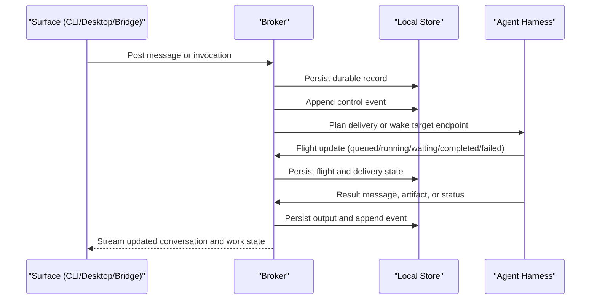

# OpenScout Control Protocol

`@openscout/protocol` defines the durable local communication and execution contract for OpenScout.

This package is intentionally not named `relay`. Relay is now a surface and compatibility layer. The control protocol is the canonical model underneath it.

For the definitive Scout vocabulary and A2A posture, see [docs/concepts.md](../../docs/concepts.md).

Scout is aware of adjacent standards such as A2A, but this package is not trying to become an A2A clone. The goal is clean correspondence without giving up Scout-specific mechanics such as broker-owned routing, `invocation` plus `flight`, or the `question` / `work_item` collaboration model.

## Quickstart

`@openscout/protocol` is pure, dependency-free TypeScript: typed records, discriminated-union control events, and hand-written validators for the OpenScout control plane. Use it at the boundary where user intent becomes broker-owned state.

```ts
import {
  parseScoutComposerRoute,
  validateCollaborationRecord,
  type CollaborationUpsertCommand,
  type QuestionRecord,
} from "@openscout/protocol";

const parsed = parseScoutComposerRoute(">> hudson Can you review the parser?");
if (!parsed.route) {
  const reason = parsed.diagnostics[0]?.message ?? "missing Scout route";
  throw new Error(reason);
}

const now = Date.now();
const question: QuestionRecord = {
  id: crypto.randomUUID(),
  kind: "question",
  state: "open",
  acceptanceState: "none",
  title: parsed.body,
  createdById: "person:arach",
  ownerId: parsed.route.target.value,
  nextMoveOwnerId: parsed.route.target.value,
  createdAt: now,
  updatedAt: now,
  metadata: {
    route: parsed.route.target,
    source: "composer",
  },
};

const problems = validateCollaborationRecord(question);
if (problems.length > 0) throw new Error(problems.join("; "));

const command: CollaborationUpsertCommand = {
  kind: "collaboration.upsert",
  record: question,
};
```

## Protocol Properties

The target is a protocol that is:

- explicit: conversation, work, delivery, and external bindings are separate records
- durable: clients and adapters submit commands to the broker instead of writing coordination records directly
- addressable: actors, conversations, messages, invocations, flights, and deliveries all have stable IDs
- replayable: read models can be rebuilt from durable records and events
- observable: status, ownership, outputs, and failures are inspectable
- recoverable: broker restarts do not have to erase the story of what happened
- harness-agnostic: harness details live at endpoints and adapters, not in the protocol itself

If someone asks why this is better than terminal scrollback or ad hoc file sharing, that is the answer.

## Core Model

The protocol keeps a small set of nouns and gives each one a single job:

- `actor`: an identity in the system such as a person, helper, agent, system process, bridge, or device
- `agent`: a durable autonomous target with capabilities and one or more endpoints
- `conversation`: an addressable context boundary such as a channel, direct message, thread, or system conversation
- `message`: a human-readable conversation record
- `invocation`: an explicit request for work
- `flight`: the tracked lifecycle of one invocation
- `delivery`: a transport-specific fan-out intent for a message or invocation
- `binding`: a mapping from an OpenScout conversation to an external thread or channel
- `event`: an append-only fact emitted whenever one of the durable records changes

For discovery, Scout also uses a `ScoutAgentCard`: a local discovery and routing card that overlaps intentionally with A2A-style discovery fields such as provider, skills, supported interfaces, and security hints without claiming to be the A2A wire-level `AgentCard`.

## Collaboration Model

Use collaboration records when an ask or task needs durable ownership, state, or
handoff. Keep ordinary discussion in `message` records. Use `invocation` and
`flight` for execution requests and their runtime lifecycle. Use collaboration
records for questions and work items that need to be tracked across surfaces.

The canonical collaboration kinds are:

- `question`: a specific ask that can be `open`, `answered`, `closed`, or
  `declined`
- `work_item`: durable execution with an owner, next move, progress, and states
  such as `open`, `working`, `waiting`, `review`, `done`, and `cancelled`

These are peers, not points on one severity ladder:

- a question can resolve directly
- a question can attach to a work item
- a question can spawn a work item
- a work item can accumulate progress, waiting conditions, and review state

Acceptance is modeled separately from workflow state so that a reply and satisfaction do
not collapse into one transition. A work item can be done without peer acceptance, and a
question can be answered without being closed yet.

These collaboration shapes are backed by the runtime. The broker persists collaboration
records and events to its local store (`collaboration.upsert` and
`collaboration.event.append` commands, `collaboration_records` and `collaboration_events`
tables) and emits `collaboration.upserted` / `collaboration.event.appended` control events.
See [docs/agents-and-collaboration.md](../../docs/agents-and-collaboration.md) for the
full collaboration model.

## Identity Model

The important distinction is between a helper and an agent:

- `person`: the actual human identity
- `helper`: a session-bound assistant working on behalf of a person
- `agent`: a durable autonomous player with its own identity and capabilities
- `system`: runtime-owned internal identity
- `bridge`: external platform adapter identity
- `device`: a concrete endpoint such as a native app client or speaker session

This lets a person work with a helper in Codex or Claude while still invoking real agents as first-class targets.

## Composer Route Operator

Scout-aware text inputs can use `>>` to route without relying on `@` mentions
owned by the host UI:

```text
/scout:ask >> hudson Review the parser.
```

The route operator is composer syntax, not message payload. The protocol package
exports `parseScoutComposerRoute`, `SCOUT_COMPOSER_ROUTE_OPERATOR`, and
`SCOUT_TARGET_HANDLE_SHORTHAND` so clients can translate `>> hudson`,
`>> target:mw-talkie`, `>> ⌖mw-talkie`, `>> ref:8kj4pd`, `>> channel:ops`,
or `>> broadcast` into structured `ScoutRouteTarget` metadata before
submitting to the broker.

## Core Design Rules

1. A message is conversation.
2. An invocation is work.
3. A flight is the tracked lifecycle of that work.
4. Delivery is planned explicitly per target and transport.
5. Bindings map external channels into the same internal model.
6. Clients and adapters submit commands to the broker instead of writing Scout-owned coordination records directly.
7. Harnesses own their primary transcripts and logs; Scout links to and observes them without importing them as canonical messages.

## Conversation, Work, And Delivery

### Conversation

Conversation is human-readable history:

- channels
- direct messages
- group direct messages
- threads
- system conversations

Conversation state is designed for:

- visibility
- unread tracking
- mentions
- search
- auditability

### Invocation

Invocation is a request for action:

- consult an agent
- execute a task
- summarize state
- report status
- wake an agent

Invocations create flights. Flights stream lifecycle state separately from the chat surface they came from.

### Delivery

Each authored message exists once. Delivery fans out into typed intents.

The runtime plans deliveries separately for:

- conversation visibility
- notifications
- explicit invocations
- bridge outbound traffic
- speech playback

That means a single message can be visible to a channel, notify a mention, invoke an agent, and bridge outbound without duplicating the body.

## Lifecycle



The important part is the separation:

- messages make the conversation legible
- invocations make work explicit
- flights track execution without overloading chat
- deliveries make routing visible instead of implicit

## Storage Model

The runtime package owns the local storage and projection schema for Scout-owned control-plane records. The durable model is:

- `nodes`
- `actors`
- `agents`
- `agent_endpoints`
- `conversations`
- `conversation_members`
- `messages`
- `message_mentions`
- `message_attachments`
- `invocations`
- `flights`
- `bindings`
- `deliveries`
- `delivery_attempts`
- `events`

These are first-party Scout facts: records created by Scout surfaces, agent tools, the broker, or mesh forwarding. Local projections such as SQLite make those facts cheap to inspect, query, and render across surfaces.

External harness transcripts are different. Claude Code JSONL, Codex session JSONL, and future harness logs are source material owned by their harnesses. Scout can observe them through adapters and tail views, but the protocol should not treat every external transcript turn as a Scout `message` or require bulk transcript replication into the control-plane database.

## Durability

The protocol is designed so that the system does not depend on terminal scrollback to remember what happened.

- messages are durable conversation records
- invocations are durable work requests
- flights are durable execution state
- deliveries and delivery attempts make routing and failures inspectable
- bindings make external channel mappings durable
- append-only events let read models be rebuilt
- external harness transcript files remain linkable and observable without becoming Scout-owned conversation records

That does not require every surface to be smart. The broker owns the hard part, and the surfaces can recover by reading the canonical store.

## Harness-Agnostic By Design

OpenScout should not fork its protocol per harness.

- endpoint records describe `harness`, `transport`, `session_id`, `cwd`, and `project_root`
- the same invocation and flight model applies whether the endpoint is Claude, Codex, tmux, or a future harness
- harness-specific launch and wake behavior belongs in runtime adapters
- bridge integrations stay at the edge and map into the same durable model

This keeps the protocol stable even when the execution layer changes.

## Transport And Media

The protocol is text-first and transport-agnostic. Commands, subscriptions,
bridge delivery, and media references travel through transport records or
metadata; raw media does not belong in the canonical conversation log.

- HTTP: commands, admin, webhook intake
- WebSocket: subscriptions, streaming flight updates, typing/presence
- local socket: trusted local clients such as the native app and CLI
- bridges: Telegram, Discord, telecom adapters
- media attachments: transcripts, playback directives, and file references

Transport-specific behavior belongs at adapters and runtime surfaces. The
protocol keeps the durable record shape stable.

## Package Commands

From the repo root:

```bash
npm --prefix packages/protocol run build
npm --prefix packages/protocol run check
npm --prefix packages/protocol run test
```
