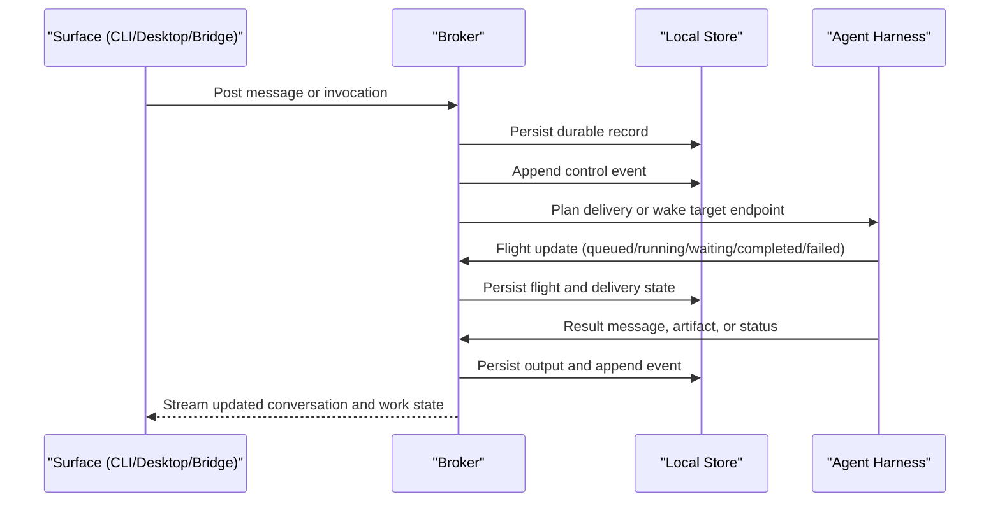

# OpenScout Control Protocol

`@openscout/protocol` defines the durable local communication and execution contract for OpenScout.

This package is intentionally not named `relay`. Relay is now a surface and compatibility layer. The control protocol is the canonical model underneath it.

## What Makes This A Good Local Communication Protocol

The target is a protocol that is:

- explicit: conversation, work, delivery, and external bindings are separate records
- durable: the broker is the only writer and local state is stored canonically
- addressable: actors, conversations, messages, invocations, flights, and deliveries all have stable IDs
- replayable: read models can be rebuilt from durable records and events
- observable: status, ownership, outputs, and failures are inspectable
- recoverable: broker restarts do not have to erase the story of what happened
- harness-agnostic: harness details live at endpoints and adapters, not in the protocol itself

If someone asks why this is better than terminal scrollback or ad hoc file sharing, that is the answer.

## Core Model

The protocol keeps a small set of nouns and gives each one a single job:

- `actor`: an identity in the system such as a person, helper, agent, system process, bridge, or device
- `agent`: a durable autonomous target with capabilities and one or more endpoints
- `conversation`: an addressable context boundary such as a channel, direct message, thread, or system conversation
- `message`: a human-readable conversation record
- `invocation`: an explicit request for work
- `flight`: the tracked lifecycle of one invocation
- `delivery`: a transport-specific fan-out intent for a message or invocation
- `binding`: a mapping from an OpenScout conversation to an external thread or channel
- `event`: an append-only fact emitted whenever one of the durable records changes

## Emerging Collaboration Model

The protocol package now also exports a collaboration vocabulary for the next layer above
messages and invocations. This is the first thin slice toward explicit human-agent and
agent-agent workflow tracking. It is intentionally small.

The current canonical collaboration kinds are:

- `question`: a lightweight information-seeking interaction with states such as `open`,
  `answered`, `closed`, and `declined`
- `work_item`: a durable execution object with states such as `open`, `working`,
  `waiting`, `review`, `done`, and `cancelled`

These are peers, not points on one severity ladder:

- a question can resolve directly
- a question can attach to a work item
- a question can spawn a work item
- a work item can accumulate progress, waiting conditions, and review state without
  pretending it started as a question

Acceptance is modeled separately from workflow state so that a reply and satisfaction do
not collapse into one transition. A work item can be done without peer acceptance, and a
question can be answered without being closed yet.

The exported collaboration shapes are a protocol vocabulary for upcoming runtime and UI
work. They do not yet imply that the broker persists the full collaboration layer today.
See [docs/collaboration-workflows-v1.md](../../docs/collaboration-workflows-v1.md) for the
v1 model.

## Identity Model

The important distinction is between a helper and an agent:

- `person`: the actual human identity
- `helper`: a session-bound assistant working on behalf of a person
- `agent`: a durable autonomous player with its own identity and capabilities
- `system`: runtime-owned internal identity
- `bridge`: external platform adapter identity
- `device`: a concrete endpoint such as a native app client or speaker session

This lets a person work with a helper in Codex or Claude while still invoking real agents as first-class targets.

## Core Design Rules

1. A message is conversation.
2. An invocation is work.
3. A flight is the tracked lifecycle of that work.
4. Delivery is planned explicitly per target and transport.
5. Bindings map external channels into the same internal model.
6. Voice is metadata and transport, not the canonical message body.
7. The broker is the only canonical writer.

## Bootstrap And Startup

The intended machine lifecycle is:

1. `scout setup` creates machine-local settings, a relay agent registry, and repo-local `.openscout/project.json` when needed.
2. The runtime installs a launch agent under `~/Library/LaunchAgents/` for the broker.
3. `launchd` keeps the broker process alive and restarts it if it exits.
4. Workspace discovery scans configured roots and repo-local manifests to map projects to agent identities.
5. Agents register endpoints that describe their harness, transport, session, cwd, and project root.
6. Surfaces such as the desktop shell, CLI, and relay compatibility layer talk to the broker instead of writing shared files directly.

## Conversation, Work, And Delivery

### Conversation

Conversation is human-readable history:

- channels
- direct messages
- group direct messages
- threads
- system conversations

Conversation state is designed for:

- visibility
- unread tracking
- mentions
- search
- auditability

### Invocation

Invocation is a request for action:

- consult an agent
- execute a task
- summarize state
- report status
- wake an agent

Invocations create flights. Flights stream lifecycle state separately from the chat surface they came from.

### Delivery

Each authored message exists once. Delivery fans out into typed intents.

The runtime plans deliveries separately for:

- conversation visibility
- notifications
- explicit invocations
- bridge outbound traffic
- speech playback

That means a single message can be visible to a channel, notify a mention, invoke an agent, and bridge outbound without duplicating the body.

## Lifecycle

The important part is the separation:

- messages make the conversation legible
- invocations make work explicit
- flights track execution without overloading chat
- deliveries make routing visible instead of implicit

## Storage Model

The runtime package owns the SQLite schema. The durable model is:

- `nodes`
- `actors`
- `agents`
- `agent_endpoints`
- `conversations`
- `conversation_members`
- `messages`
- `message_mentions`
- `message_attachments`
- `invocations`
- `flights`
- `bindings`
- `deliveries`
- `delivery_attempts`
- `events`

SQLite is the canonical store because it stays local and inspectable while handling append races, indexing, leases, retries, and subscriptions better than raw JSONL.

## Why Work Does Not Get Lost

The protocol is designed so that the system does not depend on terminal scrollback to remember what happened.

- messages are durable conversation records
- invocations are durable work requests
- flights are durable execution state
- deliveries and delivery attempts make routing and failures inspectable
- bindings make external channel mappings durable
- append-only events let read models be rebuilt

That does not require every surface to be smart. The broker owns the hard part, and the surfaces can recover by reading the canonical store.

## Harness-Agnostic By Design

OpenScout should not fork its protocol per harness.

- endpoint records describe `harness`, `transport`, `session_id`, `cwd`, and `project_root`
- the same invocation and flight model applies whether the endpoint is Claude, Codex, tmux, or a future harness
- harness-specific launch and wake behavior belongs in runtime adapters
- bridge integrations stay at the edge and map into the same durable model

This keeps the protocol stable even when the execution layer changes.

## Modalities

The protocol supports multiple modalities, but text remains canonical.

- HTTP: commands, admin, webhook intake
- WebSocket: subscriptions, streaming flight updates, typing/presence
- local socket: trusted local clients such as the native app and CLI
- bridges: Telegram, Discord, telecom adapters
- voice: transcripts, playback directives, media references

Raw media does not belong in the primary message log. The protocol stores transcript, speech, and attachment metadata while media transport stays on a dedicated transport.

## What The Protocol Is Not

OpenScout is intentionally not trying to be:

- a hosted chat service
- a workflow engine with mandatory plan bureaucracy
- a harness-specific control plane
- a replacement for Telegram, Discord, or tmux

It is the durable local substrate that makes agent communication legible, inspectable, and recoverable.

## Migration Direction

The control protocol replaces Relay as the core architecture.

Any remaining Relay-specific tools should be treated as surfaces or compatibility utilities, not as canonical storage or runtime paths.
